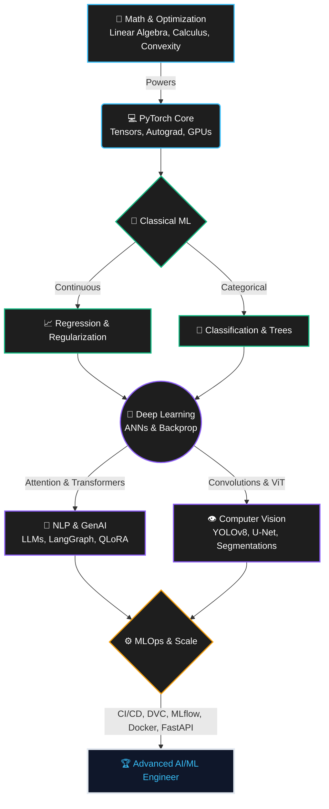

# 🚀 The 365-Day AI/ML Engineer Master Roadmap V2
### *From Mathematical Foundations to Production-Grade GenAI & MLOps*

 

 

---

> [!IMPORTANT]
> **What makes this blueprint different?**
> Most roadmaps stop at calling high-level library functions. This master curriculum is engineered for deep comprehension. It covers **mathematical derivations**, **PyTorch autograd mechanics**, **Explainable AI (SHAP/LIME)**, and **production MLOps systems** (Docker, DVC, FastAPI, MLflow, LangGraph, and MCP server systems).

---

## 🧠 Core Philosophy & Execution

1. **Mathematical Rigor**: Prove the derivatives, objective functions, and optimizations before writing code.
2. **Scratch Coding**: Implement core algorithms (Gradient Descent, Neural Nets, LSTMs, Transformers, Attention, FAISS vectors, and QLoRA math) from scratch in pure Python/NumPy/PyTorch.
3. **Systems & Serving**: Run tests, enforce validation schemas with Pydantic, dockerize models, scale vector searches, and implement structured streaming interfaces.

---

## 🗺️ The Architecture of Mastery

---

## 📊 Live Curriculum Tracker (365 Days V2)

| Phase | Title / Scope | Timeline | Status | Mastery Progress |
| :---: | :--- | :---: | :---: | :--- |
| **01** | **Core ML & Foundations** (Regression, Classification, SVM, Trees, AdaBoost) | Days 01–39 | ✅ | 🟩🟩🟩🟩🟩🟩🟩🟩🟩🟩 `100%` |
| **02** | **Finish Core & Advanced Classical ML** (XGBoost, LightGBM, CatBoost, Pipelines, XAI) | Days 40–56 | 🔜 | ⬜⬜⬜⬜⬜⬜⬜⬜⬜⬜ `0%` |
| **03** | **Unsupervised Learning, Time Series & E2E Tabular ML Project** | Days 57–77 | 🔜 | ⬜⬜⬜⬜⬜⬜⬜⬜⬜⬜ `0%` |
| **04** | **Deep Learning Foundations & PyTorch** (MLP, Backprop derivatives, AdamW) | Days 78–119 | 🔜 | ⬜⬜⬜⬜⬜⬜⬜⬜⬜⬜ `0%` |
| **05** | **Computer Vision & Multimodal AI** (CNNs, YOLOv8, U-Net Segmentations, ViTs) | Days 120–161| 🔜 | ⬜⬜⬜⬜⬜⬜⬜⬜⬜⬜ `0%` |
| **06** | **Sequence Models & Recurrent Architectures** (BPTT, LSTM/GRU, attention scoring) | Days 162–182| 🔜 | ⬜⬜⬜⬜⬜⬜⬜⬜⬜⬜ `0%` |
| **07** | **NLP & Transformer Ecosystem** (Word2Vec, MHA, Encoder-Decoder, BERT/GPT, Hugging Face) | Days 183–231| 🔜 | ⬜⬜⬜⬜⬜⬜⬜⬜⬜⬜ `0%` |
| **08** | **MLOps & Data Engineering Essentials** (SQL window functions, Docker, DVC, MLflow, CI/CD) | Days 232–259| 🔜 | ⬜⬜⬜⬜⬜⬜⬜⬜⬜⬜ `0%` |
| **09** | **Generative AI, RAG & LLM Fine-Tuning** (Hybrid search, RAGAS, LoRA/QLoRA math, Llama-3) | Days 260–308| 🔜 | ⬜⬜⬜⬜⬜⬜⬜⬜⬜⬜ `0%` |
| **10** | **Agentic AI Systems & Multi-Agent Workflows** (LangGraph stateful graphs, MCP, HITL) | Days 309–336| 🔜 | ⬜⬜⬜⬜⬜⬜⬜⬜⬜⬜ `0%` |
| **11** | **Reinforcement Learning Fundamentals** (MDP, Bellman equation, Q-Learning, DQN, PPO) | Days 337–350| 🔜 | ⬜⬜⬜⬜⬜⬜⬜⬜⬜⬜ `0%` |
| **12** | **LLMOps, Production Capstone & Career Readiness** (Langfuse observability, Capstone) | Days 351–365| 🔜 | ⬜⬜⬜⬜⬜⬜⬜⬜⬜⬜ `0%` |

---

## 🏆 Mandatory Portfolio Projects

During the course of the next 326 days, the following **8 production-grade systems** will be built and documented:

1. **End-to-End Tabular ML System** (Days 069–076)
2. **Deep Learning PyTorch Pipeline** (Days 111–117)
3. **Computer Vision System** (Days 150–159)
4. **Transformer NLP Application** (Days 219–226)
5. **Production MLOps Pipeline** (Days 254–258)
6. **Advanced Production RAG System** (Days 299–307)
7. **Production Agentic AI System** (Days 329–335)
8. **Final Flagship Production Capstone** (Days 359–362)

---

## 📚 Granular Executable Roadmap

The detailed, daily task-by-task roadmap schedule, focus topics, tasks, and outputs are maintained in **[roadmap.txt](file:///d:/Desktop/repos/AI-ML-Blueprint/roadmap.txt)** at the root of this repository.

### 📅 Current Execution State
* **Last Completed Day**: Day 039 — AdaBoost - Adaptive Boosting (Decisions stumps, weights update logic)
* **Next Target Day**: Day 040 — Gradient Boosting Intuition & Implementation

---
⭐️ *Built by Sahil Kumar — Pursuing the pinnacle of AI/ML engineering, mathematical rigor, and production-scale systems.*
