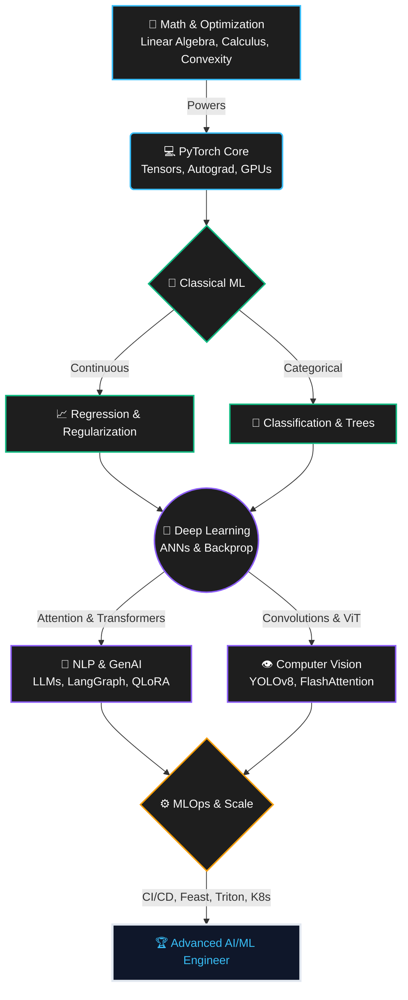

# 🚀 SAHIL K-Y
### *From Mathematical Foundations to Production-Grade GenAI & MLOps*

 

 

---

> [!IMPORTANT]
> **What makes this blueprint different?**
> Most roadmaps stop at calling high-level library functions. This master curriculum is engineered for deep comprehension. It covers **mathematical derivations**, **PyTorch autograd mechanics**, **Explainable AI (SHAP/LIME)**, and **hardcore MLOps systems** (Triton Inference Server, Kubernetes, Feast Feature Stores).

---

## 🧠 Core Philosophy & Execution

## 🗺️ The Architecture of Mastery

---

## 📊 Live Curriculum Tracker (214 Days)

| Phase | Title / Scope | Timeline | Status | Mastery Progress |
| :---: | :--- | :---: | :---: | :--- |
| **01** | Linear Regression, Regularization & Math | Days 01–13 | ✅ | 🟩🟩🟩🟩🟩🟩🟩🟩🟩🟩 `100%` |
| **02** | Logistic Regression & Classification | Days 14–21 | ✅ | 🟩🟩🟩🟩🟩🟩🟩🟩🟩🟩 `100%` |
| **03** | Tree Models, SVM & Base Ensembles | Days 22–38 | ✅ | 🟩🟩🟩🟩🟩🟩🟩🟩🟩🟩 `100%` |
| **04** | Boosting & Advanced Ensembles | Days 39–53 | 🔜 | ⬜⬜⬜⬜⬜⬜⬜⬜⬜⬜ `0%` |
| **05** | Adv. Preprocessing, Imbalanced Learning & XAI | Days 54–69 | 🔜 | ⬜⬜⬜⬜⬜⬜⬜⬜⬜⬜ `0%` |
| **06** | Unsupervised Learning & PCA | Days 70–85 | 🔜 | ⬜⬜⬜⬜⬜⬜⬜⬜⬜⬜ `0%` |
| **07** | Time Series Analysis & Forecasting | Days 86–96 | 🔜 | ⬜⬜⬜⬜⬜⬜⬜⬜⬜⬜ `0%` |
| **08** | Deep Learning: ANNs, Optimizers & PyTorch | Days 97–112| 🔜 | ⬜⬜⬜⬜⬜⬜⬜⬜⬜⬜ `0%` |
| **09** | Deep Learning: CNNs & Custom Architectures | Days 113–123| 🔜 | ⬜⬜⬜⬜⬜⬜⬜⬜⬜⬜ `0%` |
| **10** | Deep Learning: RNNs & Sequence Models | Days 124–133| 🔜 | ⬜⬜⬜⬜⬜⬜⬜⬜⬜⬜ `0%` |
| **11** | SOTA NLP & Transformers | Days 134–149| 🔜 | ⬜⬜⬜⬜⬜⬜⬜⬜⬜⬜ `0%` |
| **12** | Advanced Computer Vision & ViTs | Days 150–164| 🔜 | ⬜⬜⬜⬜⬜⬜⬜⬜⬜⬜ `0%` |
| **13** | MLOps: Infrastructure, APIs & Docker | Days 165–174| 🔜 | ⬜⬜⬜⬜⬜⬜⬜⬜⬜⬜ `0%` |
| **14** | MLOps: Pipelines, Feature Stores & CI/CD | Days 175–189| 🔜 | ⬜⬜⬜⬜⬜⬜⬜⬜⬜⬜ `0%` |
| **15** | Generative AI & LLM Fine-Tuning | Days 190–199| 🔜 | ⬜⬜⬜⬜⬜⬜⬜⬜⬜⬜ `0%` |
| **16** | Agentic AI & Autonomous Systems | Days 200–207| 🔜 | ⬜⬜⬜⬜⬜⬜⬜⬜⬜⬜ `0%` |
| **17** | Interview Preps & Advanced Architectures | Days 208–214| 🔜 | ⬜⬜⬜⬜⬜⬜⬜⬜⬜⬜ `0%` |

---

## 📚 The Complete 214-Day Granular Curriculum

> [!TIP]
> **Expand the sections below** to view the rigorous day-by-day progression. Every single day involves mathematical derivations, custom PyTorch code, and advanced MLOps integrations.

<b>🔥 Click to Expand: Phase 1: Linear Regression & Regularization</b>

 

<ul>
  <li>
<b>Day 001 | 01 Jun 2026, Mon:</b> <i>Cost Function MSE Math</i> <code>Day 001 - Cost Function MSE.ipynb (Pure NumPy vectorized MSE calculator and proof of convexity).</code>
</li>
  <li>
<b>Day 002 | 02 Jun 2026, Tue:</b> <i>Gradient Descent convergence</i> <code>Day 002 - Gradient Descent.ipynb (Step-by-step Batch vs. SGD convergence comparison from scratch).</code>
</li>
  <li>
<b>Day 003 | 03 Jun 2026, Wed:</b> <i>Linear Regression Closed-Form Solver</i> <code>Day 003 - Linear Regression SVD Solver.ipynb (Custom linear regression class using SVD/Pseudoinverse).</code>
</li>
  <li>
<b>Day 004 | 04 Jun 2026, Thu:</b> <i>Model Evaluation Rigor</i> <code>Day 004 - Model Evaluation.ipynb (Evaluation script computing R², Adjusted R², MAE, RMSE, and MAPE from scratch).</code>
</li>
  <li>
<b>Day 005 | 05 Jun 2026, Fri:</b> <i>Multiple Regression & Multicollinearity</i> <code>Day 005 - Multiple Linear Regression.ipynb (VIF calculator and regression assumption diagnostics pipeline).</code>
</li>
  <li>
<b>Day 006 | 06 Jun 2026, Sat:</b> <i>Polynomial Regression & Bias-Variance Tradeoff</i> <code>Day 006 - Polynomial Regression.ipynb (Fitting high-degree polynomials, plotting training vs. validation loss curve).</code>
</li>
  <li>
<b>Day 007 | 07 Jun 2026, Sun:</b> <i>Ridge & Lasso (L1 & L2 Regularization)</i> <code>Day 007 - Ridge & Lasso Regression.ipynb (Sparsity visualization plotting coefficient paths as alpha varies).</code>
</li>
  <li>
<b>Day 008 | 08 Jun 2026, Mon:</b> <i>Elastic Net Regression</i> <code>Day 008 - Elastic Net Regression.ipynb (Tuning l1_ratio and alpha using cross-validation).</code>
</li>
  <li>
<b>Day 009 | 09 Jun 2026, Tue:</b> <i>SGD Regressor & Online Learning</i> <code>Day 009 - SGD Regressor.ipynb (Online learning simulation updating model coefficients on streaming data chunks).</code>
</li>
  <li>
<b>Day 010 | 10 Jun 2026, Wed:</b> <i>Mini Regression Project App Planning</i> <code>Day 010 - Mini Regression App Planning.ipynb (Designing a standard model API contract and schema mappings).</code>
</li>
  <li>
<b>Day 011 | 11 Jun 2026, Thu:</b> <i>House Price Prediction Project</i> <code>Day 11 - House Price Prediction Project.ipynb (Complete end-to-end model pipeline yielding top 10% Kaggle-equivalent score).</code>
</li>
  <li>
<b>Day 012 | 12 Jun 2026, Fri:</b> <i>Simple UI Prediction Integration</i> <code>Day 12 - Simple UI Integration.ipynb (Jupyter-widgets based interactive real-time house prediction dashboard).</code>
</li>
  <li>
<b>Day 013 | 13 Jun 2026, Sat:</b> <i>Regression Project Polish & Wrap-up</i> <code>Day 13 - Regression Mini Project Polish.ipynb (Productionized, modular python script directory for house pricing model).</code>
</li>
</ul>

<b>🔥 Click to Expand: Phase 2: Logistic Regression & Classification</b>

 

<ul>
  <li>
<b>Day 014 | 14 Jun 2026, Sun:</b> <i>Logistic Regression Intuition & Sigmoid</i> <code>Day 14 - Logistic Regression Intuition & Sigmoid.ipynb (Plotting sigmoid, deriving gradient of log loss mathematically).</code>
</li>
  <li>
<b>Day 015 | 15 Jun 2026, Mon:</b> <i>Logistic Regression Implementation & Metrics</i> <code>Day 15 - Logistic Regression Implementation & Metrics.ipynb (Custom metric calculator from a confusion matrix without using scikit-learn).</code>
</li>
  <li>
<b>Day 016 | 16 Jun 2026, Tue:</b> <i>Multiclass Classification (OvR vs OvO)</i> <code>Day 16 - Multiclass Classification.ipynb (Visualizing OvR vs OvO decision boundaries on 2D synthetic dataset).</code>
</li>
  <li>
<b>Day 017 | 17 Jun 2026, Wed:</b> <i>Softmax Regression (Multinomial Logistic)</i> <code>Day 17 - Softmax Regression.ipynb (Implementing Softmax regression forward pass and cross-entropy evaluation in NumPy).</code>
</li>
  <li>
<b>Day 018 | 18 Jun 2026, Thu:</b> <i>ROC-AUC & PR-AUC Curves</i> <code>Day 18 - ROC-AUC & PR-AUC Curves.ipynb (Plotting ROC and PR curves from scratch as threshold varies from 0 to 1).</code>
</li>
  <li>
<b>Day 019 | 19 Jun 2026, Fri:</b> <i>Multiclass Pipeline & Evaluation</i> <code>Day 19 - Multiclass Pipeline & Evaluation.ipynb (Full classification pipeline with detailed classification reports).</code>
</li>
  <li>
<b>Day 020 | 20 Jun 2026, Sat:</b> <i>Regularization in Logistic Regression</i> <code>Day 20 - Regularization in Logistic Regression.ipynb (Plotting feature coefficients vs. $C$ parameter value).</code>
</li>
  <li>
<b>Day 021 | 21 Jun 2026, Sun:</b> <i>Breast Cancer Classification Project</i> <code>Day 21 - Breast Cancer Classification Project.ipynb (Polished breast cancer diagnosis classifier with ROC curve analysis).</code>
</li>
</ul>

<b>🔥 Click to Expand: Phase 3: Tree Models & SVM</b>

 

<ul>
  <li>
<b>Day 022 | 22 Jun 2026, Mon:</b> <i>Decision Tree — Intuition & Mathematics</i> <code>Day 22 - Decision Tree Intuition.ipynb (Custom function computing Gini Impurity and Entropy for potential splits).</code>
</li>
  <li>
<b>Day 023 | 23 Jun 2026, Tue:</b> <i>Decision Tree — Implementation</i> <code>Day 23 - Decision Tree Implementation.ipynb (Analyzing decision tree training shapes as hyperparameters are restricted).</code>
</li>
  <li>
<b>Day 024 | 24 Jun 2026, Wed:</b> <i>Decision Tree — Overfitting & Pruning</i> <code>Day 24 - Decision Tree Pruning.ipynb (Generating ccp_alpha paths and plotting model accuracy vs. alpha).</code>
</li>
  <li>
<b>Day 025 | 25 Jun 2026, Thu:</b> <i>Decision Tree — Regressor & Comparison</i> <code>Day 25 - Decision Tree Regressor.ipynb (Fitting continuous sine wave targets, plotting step-function decision tree boundaries).</code>
</li>
  <li>
<b>Day 026 | 26 Jun 2026, Fri:</b> <i>SVM — Support Vector Machine Intuition</i> <code>Day 26 - SVM Intuition.ipynb (Visualizing support vectors and classification margin boundaries as C varies).</code>
</li>
  <li>
<b>Day 027 | 27 Jun 2026, Sat:</b> <i>SVM — Kernel Trick & Implementation</i> <code>Day 27 - SVM Kernels.ipynb (SVM boundary mappings using Linear, Polynomial, and RBF kernels on non-linear datasets).</code>
</li>
  <li>
<b>Day 028 | 28 Jun 2026, Sun:</b> <i>SVM — Hyperparameter Tuning</i> <code>Day 28 - SVM Tuning.ipynb (Grid search optimization of SVC hyperparameters, plotting accuracy heatmaps).</code>
</li>
  <li>
<b>Day 029 | 29 Jun 2026, Mon:</b> <i>Naive Bayes — Theory & Variants</i> <code>Day 29 - Naive Bayes.ipynb (Building a Multinomial Naive Bayes classifier with Laplace smoothing from scratch).</code>
</li>
  <li>
<b>Day 030 | 30 Jun 2026, Tue:</b> <i>KNN — k-Nearest Neighbors</i> <code>Day 30 - KNN Basics.ipynb (KNN classifier implementation using custom distance calculations).</code>
</li>
  <li>
<b>Day 031 | 01 Jul 2026, Wed:</b> <i>KNN — Implementation & Scaling Impact</i> <code>Day 31 - KNN Implementation.ipynb (Demonstrating classification shifts with/without standard scaling).</code>
</li>
  <li>
<b>Day 032 | 02 Jul 2026, Thu:</b> <i>Model Selection Guidelines & Leaderboard</i> <code>Day 32 - Model Leaderboard.ipynb (Establishing a master comparison notebook showing test accuracy, F1, and training latency).</code>
</li>
  <li>
<b>Day 033 | 03 Jul 2026, Fri:</b> <i>Classification Project — Algorithm Selection</i> <code>Day 33 - Classification Project.ipynb (Robust pipeline identifying candidate models for target dataset).</code>
</li>
  <li>
<b>Day 034 | 04 Jul 2026, Sat:</b> <i>Ensemble Methods — Voting & Bagging</i> <code>Day 34 - Voting Bagging Ensembles.ipynb (Implementing hard and soft voting on base classifiers).</code>
</li>
  <li>
<b>Day 035 | 05 Jul 2026, Sun:</b> <i>Random Forest — Theory & Implementation</i> <code>Day 035 - Random Forest Basics.ipynb (Custom script training forest of trees and tracking out-of-bag training validation).</code>
</li>
  <li>
<b>Day 036 | 06 Jul 2026, Mon:</b> <i>Random Forest — Hyperparameter Tuning</i> <code>Day 036 - Random Forest Tuning.ipynb (An Optuna study tuning forest models and plotting hyperparameter parallel coordinate graphs).</code>
</li>
  <li>
<b>Day 037 | 07 Jul 2026, Tue:</b> <i>Feature Importance Analysis</i> <code>Day 037 - Feature Importance.ipynb (Comparing Scikit-Learn MDI importance vs. permutation feature importance).</code>
</li>
  <li>
<b>Day 038 | 08 Jul 2026, Wed:</b> <i>Phase Review & Trees/SVM Assessment</i> <code>Day 038 - Trees SVM Assessment.ipynb (A comprehensive notebook containing 20 written question answers and boundary visualizations).</code>
</li>
</ul>

<b>🔥 Click to Expand: Phase 4: Boosting & Advanced Ensembles</b>

 

<ul>
  <li>
<b>Day 039 | 09 Jul 2026, Thu:</b> <i>AdaBoost — Adaptive Boosting</i> <code>Day 039 - AdaBoost.ipynb (Implementing custom AdaBoost with simple decision stumps from scratch).</code>
</li>
  <li>
<b>Day 040 | 10 Jul 2026, Fri:</b> <i>Gradient Boosting — Theory & Implementation</i> <code>Day 040 - Gradient Boosting.ipynb (Implementing custom Gradient Boosting regression tree algorithm).</code>
</li>
  <li>
<b>Day 041 | 11 Jul 2026, Sat:</b> <i>XGBoost — Setup & First Model</i> <code>Day 041 - XGBoost Intro.ipynb (Installing XGBoost and training classification models on baseline tabular data).</code>
</li>
  <li>
<b>Day 042 | 12 Jul 2026, Sun:</b> <i>XGBoost — Hyperparameter Deep Dive</i> <code>Day 042 - XGBoost Tuning.ipynb (Systematic hyperparameter search using grid search and Optuna).</code>
</li>
  <li>
<b>Day 043 | 13 Jul 2026, Mon:</b> <i>XGBoost — Early Stopping & Callbacks</i> <code>Day 043 - XGBoost Early Stopping.ipynb (Plotting train vs. validation log-loss curves and finding optimal iteration limits).</code>
</li>
  <li>
<b>Day 044 | 14 Jul 2026, Tue:</b> <i>LightGBM — Leaf-wise Growth & Speed</i> <code>Day 044 - LightGBM.ipynb (Implementing high-performance LightGBM models on high-cardinality datasets).</code>
</li>
  <li>
<b>Day 045 | 15 Jul 2026, Wed:</b> <i>CatBoost — Native Categorical Handling</i> <code>Day 045 - CatBoost.ipynb (CatBoost training with complex raw object features without pre-encoding).</code>
</li>
  <li>
<b>Day 046 | 16 Jul 2026, Thu:</b> <i>Ensemble Comparison — RF vs. XGB vs. LGBM vs. CatBoost</i> <code>Day 046 - Boosting Benchmark.ipynb (Benchmarking forest and boosting engines on single large dataset).</code>
</li>
  <li>
<b>Day 047 | 17 Jul 2026, Fri:</b> <i>Stacking & Blending Ensembles</i> <code>Day 047 - Stacking Ensembles.ipynb (Multi-level classification stack showing improved validation score).</code>
</li>
  <li>
<b>Day 048 | 18 Jul 2026, Sat:</b> <i>Kaggle Competition — Setup, EDA & Baseline</i> <code>Day 048 - Kaggle Baseline.ipynb (EDA log-distribution checks and basic submission generation).</code>
</li>
  <li>
<b>Day 049 | 19 Jul 2026, Sun:</b> <i>Kaggle — Validation Strategy</i> <code>Day 049 - Kaggle Validation.ipynb (Writing cross-validation helper functions that return clean OOF arrays).</code>
</li>
  <li>
<b>Day 050 | 20 Jul 2026, Mon:</b> <i>Kaggle — Feature Engineering</i> <code>Day 050 - Kaggle Feature Engineering.ipynb (Generating custom features on a housing/tabular competition dataset).</code>
</li>
  <li>
<b>Day 051 | 21 Jul 2026, Tue:</b> <i>Kaggle — Hyperparameter Tuning (Optuna)</i> <code>Day 051 - Kaggle Optuna Tuning.ipynb (A parallelized Optuna tuning loop optimizing LightGBM parameters).</code>
</li>
  <li>
<b>Day 052 | 22 Jul 2026, Wed:</b> <i>Kaggle — Ensemble Blending & Final Submission</i> <code>Day 052 - Kaggle Final Blending.ipynb (Generating optimal ensemble blend probabilities based on model correlation matrices).</code>
</li>
  <li>
<b>Day 053 | 23 Jul 2026, Thu:</b> <i>Phase Review & Boosting Assessment</i> <code>Day 053 - Boosting Assessment.ipynb (Assessment script checking conceptual model properties).</code>
</li>
</ul>

<b>🔥 Click to Expand: Phase 5: Advanced Preprocessing, Imbalanced Learning & XAI</b>

 

<ul>
  <li>
<b>Day 054 | 24 Jul 2026, Fri:</b> <i>Advanced Imputation Methods</i> <code>Day 054 - Advanced Imputation.ipynb (Comparing univariate Mean imputation vs. KNN and MICE imputation on validation sets).</code>
</li>
  <li>
<b>Day 055 | 25 Jul 2026, Sat:</b> <i>Outlier Treatment & Isolation Forests</i> <code>Day 055 - Isolation Forest Outliers.ipynb (IsolationForest outlier identification and feature scaling validation).</code>
</li>
  <li>
<b>Day 056 | 26 Jul 2026, Sun:</b> <i>Advanced Categorical Encoding</i> <code>Day 056 - Target Encoding.ipynb (Custom target encoder implementation with regularized smoothing).</code>
</li>
  <li>
<b>Day 057 | 27 Jul 2026, Mon:</b> <i>Power Transformers & Quantile Transformers</i> <code>Day 057 - Power Transforms.ipynb (Visualizing skewed distributions before and after Yeo-Johnson and Quantile transformations).</code>
</li>
  <li>
<b>Day 058 | 28 Jul 2026, Tue:</b> <i>Feature Selection Methods</i> <code>Day 058 - Feature Selection.ipynb (Feature selection comparison checking impact on model generalization).</code>
</li>
  <li>
<b>Day 059 | 29 Jul 2026, Wed:</b> <i>Spline Features & Binning</i> <code>Day 059 - Splines Binning.ipynb (Fitting continuous cyclical data with B-splines to train a robust linear regression model).</code>
</li>
  <li>
<b>Day 060 | 30 Jul 2026, Thu:</b> <i>ColumnTransformers & Pipelines in Sklearn</i> <code>Day 060 - Sklearn Pipelines.ipynb (Constructing modular, reproducible, high-throughput preprocessing pipelines).</code>
</li>
  <li>
<b>Day 061 | 31 Jul 2026, Fri:</b> <i>Data Leakage Prevention in Production</i> <code>Day 061 - Data Leakage.ipynb (Automated script scanning raw code pipelines and checking for temporal/distribution leakages).</code>
</li>
  <li>
<b>Day 062 | 01 Aug 2026, Sat:</b> <i>Model Calibration & Probability Tuning</i> <code>Day 062 - Model Calibration.ipynb (Plotting reliability curves and calibrating models to obtain true probability predictions).</code>
</li>
  <li>
<b>Day 063 | 02 Aug 2026, Sun:</b> <i>Imbalanced Classification — Metrics & Target Moving</i> <code>Day 063 - Imbalanced Metrics.ipynb (Running classification threshold sweep and finding optimal F1/cost-optimized boundaries).</code>
</li>
  <li>
<b>Day 064 | 03 Aug 2026, Mon:</b> <i>Imbalanced Sampling (SMOTE & Variants)</i> <code>Day 064 - Imbalanced Sampling.ipynb (Applying SMOTE + Tomek oversampling and comparing performance on boosted classifiers).</code>
</li>
  <li>
<b>Day 065 | 04 Aug 2026, Tue:</b> <i>Cost-Sensitive Learning & Class Weights</i> <code>Day 065 - Cost Sensitive Learning.ipynb (Implementing class weights in Random Forest and XGBoost classifiers).</code>
</li>
  <li>
<b>Day 066 | 05 Aug 2026, Wed:</b> <i>SHAP — Shapley Additive Explanations</i> <code>Day 066 - SHAP Interpretability.ipynb (Explaining gradient-boosted model predictions using SHAP values).</code>
</li>
  <li>
<b>Day 067 | 06 Aug 2026, Thu:</b> <i>LIME & Local Interpretability</i> <code>Day 067 - LIME Interpretability.ipynb (Visualizing local feature attributions on single model predictions using LIME).</code>
</li>
  <li>
<b>Day 068 | 07 Aug 2026, Fri:</b> <i>Optuna — Hyperparameter Optimization Project</i> <code>Day 068 - XAI Tuning Project.ipynb (Polished repository of an end-to-end explained, optimized tabular classifier).</code>
</li>
  <li>
<b>Day 069 | 08 Aug 2026, Sat:</b> <i>Phase Review & Preprocessing/XAI Assessment</i> <code>Day 069 - Preprocessing XAI Assessment.ipynb (Written solutions to 15 advanced tabular preprocessing and XAI interview questions).</code>
</li>
</ul>

<b>🔥 Click to Expand: Phase 6: Unsupervised Learning</b>

 

<ul>
  <li>
<b>Day 070 | 09 Aug 2026, Sun:</b> <i>Clustering Concepts</i> <code>Day 070 - Unsupervised Intro.ipynb (Implementing distance matrix computation using vectorized NumPy operations).</code>
</li>
  <li>
<b>Day 071 | 10 Aug 2026, Mon:</b> <i>K-Means Clustering — Intuition & Lloyd's Algorithm</i> <code>Day 071 - Kmeans Intuition.ipynb (Implementing Lloyd's KMeans clustering algorithm with custom initialization from scratch).</code>
</li>
  <li>
<b>Day 072 | 11 Aug 2026, Tue:</b> <i>K-Means — Elbow Method & Silhouette Analysis</i> <code>Day 072 - Kmeans Analysis.ipynb (Silhouette plot generator and clustering profiling utility).</code>
</li>
  <li>
<b>Day 073 | 12 Aug 2026, Wed:</b> <i>DBSCAN Clustering — Density-based</i> <code>Day 073 - DBSCAN Clustering.ipynb (Comparing DBSCAN and KMeans on complex, non-linear shapes like concentric rings).</code>
</li>
  <li>
<b>Day 074 | 13 Aug 2026, Thu:</b> <i>Hierarchical Clustering & Dendrograms</i> <code>Day 074 - Hierarchical Clustering.ipynb (Building agglomerative pipelines, cutting dendrograms at dynamic thresholds).</code>
</li>
  <li>
<b>Day 075 | 14 Aug 2026, Fri:</b> <i>PCA — Principal Component Analysis Math & Variance</i> <code>Day 075 - PCA Mathematics.ipynb (Implementing PCA from scratch using Singular Value Decomposition on raw matrix data).</code>
</li>
  <li>
<b>Day 076 | 15 Aug 2026, Sat:</b> <i>PCA — Feature Extraction & Reconstruction</i> <code>Day 076 - PCA Projection.ipynb (Compressing high-dimensional datasets and evaluating reconstruction loss boundaries).</code>
</li>
  <li>
<b>Day 077 | 16 Aug 2026, Sun:</b> <i>t-SNE for High-Dimensional Visualization</i> <code>Day 077 - tSNE Visualization.ipynb (Fitting t-SNE on MNIST digits, demonstrating the impact of perplexity changes).</code>
</li>
  <li>
<b>Day 078 | 17 Aug 2026, Mon:</b> <i>UMAP — Faster Non-linear Visualization</i> <code>Day 078 - UMAP Visualization.ipynb (Comparing UMAP vs. t-SNE visualization speed and global clustering separations).</code>
</li>
  <li>
<b>Day 079 | 18 Aug 2026, Tue:</b> <i>Anomaly Detection — Isolation Forest & LOF</i> <code>Day 079 - Anomaly Detection.ipynb (Benchmarking unsupervised anomaly models on synthetically contaminated datasets).</code>
</li>
  <li>
<b>Day 080 | 19 Aug 2026, Wed:</b> <i>Gaussian Mixture Models (GMM)</i> <code>Day 080 - GMM Clustering.ipynb (Fitting GMM to overlapping data, using AIC/BIC to select optimal component count).</code>
</li>
  <li>
<b>Day 081 | 20 Aug 2026, Thu:</b> <i>Customer Segmentation Project</i> <code>Day 081 - Customer Segmentation.ipynb (Customer profiling pipeline generating target group profiles).</code>
</li>
  <li>
<b>Day 082 | 21 Aug 2026, Fri:</b> <i>Dimensionality Reduction Project</i> <code>Day 082 - Dim Reduction Project.ipynb (Script evaluating model accuracy vs. input feature dimensionality).</code>
</li>
  <li>
<b>Day 083 | 22 Aug 2026, Sat:</b> <i>Clustering Comparison & Metrics</i> <code>Day 083 - Clustering Metrics.ipynb (Computing clustering indices from ground-truth validations).</code>
</li>
  <li>
<b>Day 084 | 23 Aug 2026, Sun:</b> <i>Unsupervised Learning Capstone Setup</i> <code>Day 084 - Unsupervised Capstone.ipynb (Baseline pipeline architecture template for the capstone clustering task).</code>
</li>
  <li>
<b>Day 085 | 24 Aug 2026, Mon:</b> <i>Phase Review & Unsupervised Assessment</i> <code>Day 085 - Unsupervised Assessment.ipynb (Answers to 15 advanced unsupervised learning system design questions).</code>
</li>
</ul>

<b>🔥 Click to Expand: Phase 7: Time Series Analysis</b>

 

<ul>
  <li>
<b>Day 086 | 25 Aug 2026, Tue:</b> <i>Time Series Components & Decomposition</i> <code>Day 086 - Time Series Intro.ipynb (Implementing seasonal decomposition from scratch using moving averages).</code>
</li>
  <li>
<b>Day 087 | 26 Aug 2026, Wed:</b> <i>Stationarity & Dickey-Fuller Test</i> <code>Day 087 - Stationarity.ipynb (Calculating rolling statistics and evaluating stationarity using statsmodels ADF test).</code>
</li>
  <li>
<b>Day 088 | 27 Aug 2026, Thu:</b> <i>ACF & PACF Plots</i> <code>Day 088 - ACF PACF.ipynb (Plotting autocorrelation and partial autocorrelation and identifying lag limits).</code>
</li>
  <li>
<b>Day 089 | 28 Aug 2026, Fri:</b> <i>ARIMA Models</i> <code>Day 089 - ARIMA.ipynb (Fitting ARIMA models on stock indexes and checking residuals for white noise behavior).</code>
</li>
  <li>
<b>Day 090 | 29 Aug 2026, Sat:</b> <i>SARIMA Models</i> <code>Day 090 - SARIMA.ipynb (Fitting seasonal SARIMA models to forecast monthly electricity/airline demand).</code>
</li>
  <li>
<b>Day 091 | 30 Aug 2026, Sun:</b> <i>Facebook Prophet Basics</i> <code>Day 091 - Prophet Intro.ipynb (Fitting Facebook Prophet on simple daily website traffic logs).</code>
</li>
  <li>
<b>Day 092 | 31 Aug 2026, Mon:</b> <i>Prophet Advanced Features</i> <code>Day 092 - Prophet Advanced.ipynb (Configuring multi-variable Prophet forecast with custom calendar inputs).</code>
</li>
  <li>
<b>Day 093 | 01 Sep 2026, Tue:</b> <i>Time Series Forecasting with ML</i> <code>Day 093 - ML Time Series.ipynb (Feature engineering pipeline converting continuous time-series into tabular datasets for XGBoost).</code>
</li>
  <li>
<b>Day 094 | 02 Sep 2026, Wed:</b> <i>Demand Forecasting Project</i> <code>Day 094 - Demand Forecasting Project.ipynb (A master time series evaluation comparison notebook on real retail data).</code>
</li>
  <li>
<b>Day 095 | 03 Sep 2026, Thu:</b> <i>Advanced Time Series</i> <code>Day 095 - Advanced Time Series.ipynb (Running Granger causality and fitting VAR models to macroeconomic datasets).</code>
</li>
  <li>
<b>Day 096 | 04 Sep 2026, Fri:</b> <i>Phase Review & TS Assessment</i> <code>Day 096 - TS Assessment.ipynb (Written solutions to 12 core time series forecasting interview questions).</code>
</li>
</ul>

<b>🔥 Click to Expand: Phase 8: Deep Learning — ANN & Optimizers</b>

 

<ul>
  <li>
<b>Day 097 | 05 Sep 2026, Sat:</b> <i>Deep Learning Intro & Perceptron</i> <code>Day 097 - Perceptron.ipynb (Implementing a single Perceptron with step activation function from scratch).</code>
</li>
  <li>
<b>Day 098 | 06 Sep 2026, Sun:</b> <i>Multi-layer Perceptrons & Forward Propagation</i> <code>Day 098 - MLP Forward.ipynb (Implementing feedforward network forward propagation loop in pure vectorized NumPy).</code>
</li>
  <li>
<b>Day 099 | 07 Sep 2026, Mon:</b> <i>Activation Functions</i> <code>Day 099 - Activations.ipynb (Plotting activations and their derivatives, checking gradient profiles).</code>
</li>
  <li>
<b>Day 100 | 08 Sep 2026, Tue:</b> <i>Loss Functions</i> <code>Day 100 - Loss Functions.ipynb (Writing standard loss functions and their derivatives in Python).</code>
</li>
  <li>
<b>Day 101 | 09 Sep 2026, Wed:</b> <i>Backpropagation — Chain Rule & Math</i> <code>Day 101 - Backpropagation Math.ipynb (Mathematical worksheets step-by-step backpropagating loss through a 3-layer neural network).</code>
</li>
  <li>
<b>Day 102 | 10 Sep 2026, Thu:</b> <i>Manual Backpropagation Implementation</i> <code>Day 102 - Numpy Neural Network.ipynb (Numpy-only multi-layer classification neural network trained from scratch).</code>
</li>
  <li>
<b>Day 103 | 11 Sep 2026, Fri:</b> <i>Optimizers</i> <code>Day 103 - Optimizers.ipynb (Custom optimizer implementations comparison checking training path behaviors).</code>
</li>
  <li>
<b>Day 104 | 12 Sep 2026, Sat:</b> <i>Learning Rate Scheduling</i> <code>Day 104 - LR Scheduling.ipynb (Writing and plotting dynamic learning rate schedules over epochs).</code>
</li>
  <li>
<b>Day 105 | 13 Sep 2026, Sun:</b> <i>TensorFlow & Keras Basics</i> <code>Day 105 - Keras Basics.ipynb (TensorFlow tensor manipulations and tf.GradientTape automatic differentiation validations).</code>
</li>
  <li>
<b>Day 106 | 14 Sep 2026, Mon:</b> <i>ANN Implementation in Keras</i> <code>Day 106 - Keras ANN.ipynb (Keras classification neural network trained on synthetic non-linear classifications).</code>
</li>
  <li>
<b>Day 107 | 15 Sep 2026, Tue:</b> <i>PyTorch Basics — Tensors & Autograd</i> <code>Day 107 - PyTorch Basics.ipynb (PyTorch tensor math, verifying autograd gradients against analytical derivatives).</code>
</li>
  <li>
<b>Day 108 | 16 Sep 2026, Wed:</b> <i>PyTorch Custom Models & Datasets</i> <code>Day 108 - PyTorch Datasets.ipynb (Writing fully custom PyTorch multi-class classifiers with customized datasets).</code>
</li>
  <li>
<b>Day 109 | 17 Sep 2026, Thu:</b> <i>PyTorch Training Loop</i> <code>Day 109 - PyTorch Training Loop.ipynb (Complete training loop with batch tracking and validation scoring).</code>
</li>
  <li>
<b>Day 110 | 18 Sep 2026, Fri:</b> <i>Dropout & Batch Normalization</i> <code>Day 110 - Dropout BatchNorm.ipynb (Adding Dropout and BatchNorm to PyTorch models and checking validation stability).</code>
</li>
  <li>
<b>Day 111 | 19 Sep 2026, Sat:</b> <i>ANN Hyperparameter Tuning & Optuna</i> <code>Day 111 - ANN Tuning Project.ipynb (Robust script utilizing Optuna to find top performing PyTorch configuration).</code>
</li>
  <li>
<b>Day 112 | 20 Sep 2026, Sun:</b> <i>Phase Review & DL Foundations Review</i> <code>Day 112 - DL Foundations Review.ipynb (Written answers to 15 advanced deep learning foundational questions).</code>
</li>
</ul>

<b>🔥 Click to Expand: Phase 9: Deep Learning — CNN</b>

 

<ul>
  <li>
<b>Day 113 | 21 Sep 2026, Mon:</b> <i>CNN Intuition</i> <code>Day 113 - CNN Intuition.ipynb (Custom function executing 2D matrix convolution using custom kernels in NumPy).</code>
</li>
  <li>
<b>Day 114 | 22 Sep 2026, Tue:</b> <i>Pooling Layers & CNN Architecture Design</i> <code>Day 114 - Pooling Layers.ipynb (Analyzing activation shape size transformations through sequential convolutional and pooling layers).</code>
</li>
  <li>
<b>Day 115 | 23 Sep 2026, Wed:</b> <i>CNN Implementation in Keras & PyTorch</i> <code>Day 115 - CNN Code.ipynb (CNN training on the MNIST/CIFAR-10 datasets using both PyTorch and Keras layers).</code>
</li>
  <li>
<b>Day 116 | 24 Sep 2026, Thu:</b> <i>Image Data Augmentation</i> <code>Day 116 - Data Augmentation.ipynb (Setting up PyTorch torchvision transforms and visual data augmentations).</code>
</li>
  <li>
<b>Day 117 | 25 Sep 2026, Fri:</b> <i>CNN Architectures — LeNet, AlexNet, VGG</i> <code>Day 117 - Classic CNNs.ipynb (Rebuilding the classic VGG-16 model architectural blocks in PyTorch).</code>
</li>
  <li>
<b>Day 118 | 26 Sep 2026, Sat:</b> <i>ResNet & Skip Connections</i> <code>Day 118 - ResNet.ipynb (Implementing ResNet residual blocks and building a custom ResNet-18 model).</code>
</li>
  <li>
<b>Day 119 | 27 Sep 2026, Sun:</b> <i>Inception & MobileNet</i> <code>Day 119 - Inception MobileNet.ipynb (Implementing depthwise separable convolutions in PyTorch, parameter tracking).</code>
</li>
  <li>
<b>Day 120 | 28 Sep 2026, Mon:</b> <i>Transfer Learning — Feature Extraction</i> <code>Day 120 - Transfer Learning Features.ipynb (Using pre-trained ResNet-50 for feature extraction on custom image dataset).</code>
</li>
  <li>
<b>Day 121 | 29 Sep 2026, Tue:</b> <i>Transfer Learning — Fine-Tuning</i> <code>Day 121 - Transfer Learning Finetuning.ipynb (Unfreezing ResNet top blocks, optimizing classification with small learning rates).</code>
</li>
  <li>
<b>Day 122 | 30 Sep 2026, Wed:</b> <i>Image Classification Project</i> <code>Day 122 - Image Classifier Project.ipynb (Complete image classifier with full evaluation metrics and visual activation analyses).</code>
</li>
  <li>
<b>Day 123 | 01 Oct 2026, Thu:</b> <i>Phase Review & CNN Assessment</i> <code>Day 123 - CNN Assessment.ipynb (Written solutions to 15 complex convolutional network interview questions).</code>
</li>
</ul>

<b>🔥 Click to Expand: Phase 10: Deep Learning — RNN & Sequence Models</b>

 

<ul>
  <li>
<b>Day 124 | 02 Oct 2026, Fri:</b> <i>Sequential Data & RNN Intuition</i> <code>Day 124 - RNN Intuition.ipynb (Implementing custom simple RNN cell update loops from scratch in raw NumPy).</code>
</li>
  <li>
<b>Day 125 | 03 Oct 2026, Sat:</b> <i>LSTM — Long Short-Term Memory</i> <code>Day 125 - LSTM.ipynb (Custom manual construction of LSTM forward update equations in PyTorch).</code>
</li>
  <li>
<b>Day 126 | 04 Oct 2026, Sun:</b> <i>GRU — Gated Recurrent Unit</i> <code>Day 126 - GRU.ipynb (Building custom GRU cell networks and evaluating CIFAR sequential classifications).</code>
</li>
  <li>
<b>Day 127 | 05 Oct 2026, Mon:</b> <i>Bidirectional RNNs & Stacked LSTMs</i> <code>Day 127 - Bidirectional RNN.ipynb (Constructing bidirectional stacked LSTM networks on sentiment classification classifications).</code>
</li>
  <li>
<b>Day 128 | 06 Oct 2026, Tue:</b> <i>RNN for Time Series Forecasting</i> <code>Day 128 - LSTM Time Series.ipynb (Sequence window preprocessing pipeline and LSTM continuous multivariate forecasting).</code>
</li>
  <li>
<b>Day 129 | 07 Oct 2026, Wed:</b> <i>Autoencoders — Architecture</i> <code>Day 129 - Autoencoder Basics.ipynb (Custom PyTorch undercomplete Autoencoder trained to compress and reconstruct complex signal vectors).</code>
</li>
  <li>
<b>Day 130 | 08 Oct 2026, Thu:</b> <i>Denoising & Variational Autoencoders</i> <code>Day 130 - VAE Basics.ipynb (Implementing a PyTorch Variational Autoencoder, plotting reconstructed latent spatial embeddings).</code>
</li>
  <li>
<b>Day 131 | 09 Oct 2026, Fri:</b> <i>GANs — Generative Adversarial Networks Basics</i> <code>Day 131 - GAN Intro.ipynb (Building baseline fully-connected GAN generating synthetic data scatter distributions from scratch).</code>
</li>
  <li>
<b>Day 132 | 10 Oct 2026, Sat:</b> <i>DCGAN & Training Challenges</i> <code>Day 132 - DCGAN.ipynb (Implementing a PyTorch DCGAN generating 28x28 grayscale handwritten digits).</code>
</li>
  <li>
<b>Day 133 | 11 Oct 2026, Sun:</b> <i>Sequence Project & DL Revision</i> <code>Day 133 - LSTM Text Gen Project.ipynb (Text generation using character-level LSTMs, and comparative framework checklists).</code>
</li>
</ul>

<b>🔥 Click to Expand: Phase 11: Natural Language Processing</b>

 

<ul>
  <li>
<b>Day 134 | 12 Oct 2026, Mon:</b> <i>NLP Pipeline & Text Preprocessing</i> <code>Day 134 - NLP Pipeline.ipynb (Custom class applying tokenization, stripping HTML tags, removing special chars and casing variations).</code>
</li>
  <li>
<b>Day 135 | 13 Oct 2026, Tue:</b> <i>Stemming, Lemmatization, Stop Words</i> <code>Day 135 - Text Normalization.ipynb (Comparing stemming vs. POS-aware lemmatization outputs on structured articles).</code>
</li>
  <li>
<b>Day 136 | 14 Oct 2026, Wed:</b> <i>Bag of Words & TF-IDF Vectorization</i> <code>Day 136 - TFIDF.ipynb (Writing a vectorized TF-IDF vectorizer matrix generator using only raw NumPy math).</code>
</li>
  <li>
<b>Day 137 | 15 Oct 2026, Thu:</b> <i>Word Embeddings — Word2Vec & GloVe</i> <code>Day 137 - Word2Vec.ipynb (Loading pre-trained Word2Vec embeddings and performing vector arithmetic like King - Man + Woman).</code>
</li>
  <li>
<b>Day 138 | 16 Oct 2026, Fri:</b> <i>Text Classification with ML</i> <code>Day 138 - ML Text Classification.ipynb (Pipeline classification on news/spam data using TF-IDF and MultinomialNB).</code>
</li>
  <li>
<b>Day 139 | 17 Oct 2026, Sat:</b> <i>Text Classification with DL</i> <code>Day 139 - DL Text Classification.ipynb (PyTorch model compiling embedding sequences and training classifier on sentiment data).</code>
</li>
  <li>
<b>Day 140 | 18 Oct 2026, Sun:</b> <i>Attention Mechanism Intuition</i> <code>Day 140 - Attention Mechanism.ipynb (Implementing a standalone Scaled Dot-Product Attention module in PyTorch from scratch).</code>
</li>
  <li>
<b>Day 141 | 19 Oct 2026, Mon:</b> <i>Transformer Architecture — Encoder & Decoder</i> <code>Day 141 - Transformers.ipynb (Rebuilding a full single multi-head transformer encoder block from scratch in PyTorch).</code>
</li>
  <li>
<b>Day 142 | 20 Oct 2026, Tue:</b> <i>BERT — Masked Language Modeling & NSP</i> <code>Day 142 - BERT Intro.ipynb (Loading pretrained BERT, analyzing output embeddings shapes of single tokens).</code>
</li>
  <li>
<b>Day 143 | 21 Oct 2026, Wed:</b> <i>Fine-tuning BERT for Text Classification</i> <code>Day 143 - BERT Finetuning.ipynb (Fine-tuning DistilBERT on IMDb movie review dataset, tracking metrics via tensorboard).</code>
</li>
  <li>
<b>Day 144 | 22 Oct 2026, Thu:</b> <i>Named Entity Recognition (NER) & spaCy</i> <code>Day 144 - spaCy NER.ipynb (Training spaCy pipeline model to extract specialized custom entities like product codes).</code>
</li>
  <li>
<b>Day 145 | 23 Oct 2026, Fri:</b> <i>Topic Modeling — LDA & NMF</i> <code>Day 145 - Topic Modeling.ipynb (Running LDA on text collections and analyzing topic coherence graphs).</code>
</li>
  <li>
<b>Day 146 | 24 Oct 2026, Sat:</b> <i>Sequence-to-Sequence & Machine Translation</i> <code>Day 146 - Seq2Seq Translation.ipynb (Training PyTorch translation model, evaluating performance using nltk BLEU calculations).</code>
</li>
  <li>
<b>Day 147 | 25 Oct 2026, Sun:</b> <i>Text Summarization</i> <code>Day 147 - Summarization.ipynb (Generating abstractive document summaries using pre-trained Hugging Face T5 models).</code>
</li>
  <li>
<b>Day 148 | 26 Oct 2026, Mon:</b> <i>Sentiment Analysis Project</i> <code>Day 148 - Sentiment Analysis Project.ipynb (Robust movie/product review sentiment classifier project with evaluation scripts).</code>
</li>
  <li>
<b>Day 149 | 27 Oct 2026, Tue:</b> <i>Phase Review & NLP Assessment</i> <code>Day 149 - NLP Assessment.ipynb (Written solutions to 15 complex transformer and language processing interview questions).</code>
</li>
</ul>

<b>🔥 Click to Expand: Phase 12: Computer Vision</b>

 

<ul>
  <li>
<b>Day 150 | 28 Oct 2026, Wed:</b> <i>OpenCV Image Basics & Operations</i> <code>Day 150 - OpenCV Basics.ipynb (Reading, crop/scaling, masking colored regions using numpy and cv2 libraries).</code>
</li>
  <li>
<b>Day 151 | 29 Oct 2026, Thu:</b> <i>Image Processing Filters</i> <code>Day 151 - Image Filters.ipynb (Applying custom blur, sharpening, and morphological filters to image files).</code>
</li>
  <li>
<b>Day 152 | 30 Oct 2026, Fri:</b> <i>Edge Detection & Contours</i> <code>Day 152 - Edge Contours.ipynb (Applying Canny edge detectors, isolating and measuring external shapes coordinates).</code>
</li>
  <li>
<b>Day 153 | 31 Oct 2026, Sat:</b> <i>Feature Detection — SIFT & ORB</i> <code>Day 153 - Feature Detection.ipynb (Extracting matching features between images under rotational and scale shifts).</code>
</li>
  <li>
<b>Day 154 | 01 Nov 2026, Sun:</b> <i>Object Detection Concepts</i> <code>Day 154 - Object Detection Concepts.ipynb (Writing IoU computation and non-maximum suppression (NMS) functions in pure NumPy).</code>
</li>
  <li>
<b>Day 155 | 02 Nov 2026, Mon:</b> <i>YOLO Intuition & Architecture</i> <code>Day 155 - YOLO Intuition.ipynb (Custom script dividing image into grids and calculating boundary regressions math).</code>
</li>
  <li>
<b>Day 156 | 03 Nov 2026, Tue:</b> <i>YOLOv8 Implementation & Inference</i> <code>Day 156 - YOLOv8 Inference.ipynb (Detecting classes on stock street video frames, plotting prediction outputs).</code>
</li>
  <li>
<b>Day 157 | 04 Nov 2026, Wed:</b> <i>YOLO Custom Training & Roboflow</i> <code>Day 157 - YOLO Training.ipynb (Training custom YOLOv8 detector on custom annotated dataset, plotting precision graphs).</code>
</li>
  <li>
<b>Day 158 | 05 Nov 2026, Thu:</b> <i>Image Segmentation — U-Net & Mask R-CNN</i> <code>Day 158 - Segmentation.ipynb (Implementing U-Net model architecture in PyTorch for pixel-level semantic mask segmentation).</code>
</li>
  <li>
<b>Day 159 | 06 Nov 2026, Fri:</b> <i>Face Detection & Recognition</i> <code>Day 159 - Face Recognition.ipynb (Real-time face verification checking facial embedding similarity using cosine distances).</code>
</li>
  <li>
<b>Day 160 | 07 Nov 2026, Sat:</b> <i>Stable Diffusion & Image Generation</i> <code>Day 160 - Diffusion Models.ipynb (Running text-to-image and image-to-image generation scripts via Hugging Face diffusers).</code>
</li>
  <li>
<b>Day 161 | 08 Nov 2026, Sun:</b> <i>Video Processing & Optical Flow</i> <code>Day 161 - Video Processing.ipynb (Video movement tracker plotting trajectory lines on live webcam feeds).</code>
</li>
  <li>
<b>Day 162 | 09 Nov 2026, Mon:</b> <i>Image Captioning & VQA</i> <code>Day 162 - Image Captioning.ipynb (Generating descriptive textual captions from uploaded image frames).</code>
</li>
  <li>
<b>Day 163 | 10 Nov 2026, Tue:</b> <i>Multi-Modal Models — CLIP & LLaVA</i> <code>Day 163 - Multimodal.ipynb (Running zero-shot image tagging and visual question tasks using pre-trained CLIP and LLaVA).</code>
</li>
  <li>
<b>Day 164 | 11 Nov 2026, Wed:</b> <i>Object Detection Application Project</i> <code>Day 164 - CV Capstone Project.ipynb (Webcam real-time detection stream app with adjustable parameter slider UI).</code>
</li>
</ul>

<b>🔥 Click to Expand: Phase 13: MLOps — Infrastructure & APIs</b>

 

<ul>
  <li>
<b>Day 165 | 12 Nov 2026, Thu:</b> <i>MLOps Intro & Workflow Lifecycle</i> <code>Day 165 - MLOps Intro.ipynb (Audit checklist and architecture layout templates for production-ready AI services).</code>
</li>
  <li>
<b>Day 166 | 13 Nov 2026, Fri:</b> <i>Docker Basics — Images & Containers</i> <code>Day 166 - Docker Basics.ipynb (Constructing and launching lightweight python docker environments).</code>
</li>
  <li>
<b>Day 167 | 14 Nov 2026, Sat:</b> <i>Docker Compose for Multi-Container Apps</i> <code>Day 167 - Docker Compose.ipynb (Setting up Docker Compose to orchestrate API backend, Redis database, and client services).</code>
</li>
  <li>
<b>Day 168 | 15 Nov 2026, Sun:</b> <i>FastAPI Basics</i> <code>Day 168 - FastAPI Basics.ipynb (Constructing a simple asynchronous API with request validations).</code>
</li>
  <li>
<b>Day 169 | 16 Nov 2026, Mon:</b> <i>Serving ML Models with FastAPI</i> <code>Day 169 - FastAPI Model Serving.ipynb (Asynchronous API serving predictions for an active classification model).</code>
</li>
  <li>
<b>Day 170 | 17 Nov 2026, Tue:</b> <i>Containerizing FastAPI App with Docker</i> <code>Day 170 - Dockerized FastAPI.ipynb (Dockerfile compiling python dependencies and serving model API via Uvicorn in container).</code>
</li>
  <li>
<b>Day 171 | 18 Nov 2026, Wed:</b> <i>Streamlit for Quick UI Prototyping</i> <code>Day 171 - Streamlit UI.ipynb (Streamlit client mockup for tabular classifiers prediction interactions).</code>
</li>
  <li>
<b>Day 172 | 19 Nov 2026, Thu:</b> <i>Streamlit Interactive Dashboard Project</i> <code>Day 172 - Streamlit Project.ipynb (Polished UI dashboard allowing user to upload custom tabular files and visualize predictions).</code>
</li>
  <li>
<b>Day 173 | 20 Nov 2026, Fri:</b> <i>Model Serving Optimization (ONNX Runtime)</i> <code>Day 173 - ONNX Conversion.ipynb (Converting classification model to ONNX, benchmarking CPU prediction speedups).</code>
</li>
  <li>
<b>Day 174 | 21 Nov 2026, Sat:</b> <i>Phase Review & App Deployment</i> <code>Day 174 - API Deployment Review.ipynb (Written solutions to 12 API architecture and containerization questions).</code>
</li>
</ul>

<b>🔥 Click to Expand: Phase 14: MLOps — Experiment Tracking, Pipelines & CI/CD</b>

 

<ul>
  <li>
<b>Day 175 | 22 Nov 2026, Sun:</b> <i>MLflow Experiment Tracking</i> <code>Day 175 - MLflow Tracking.ipynb (MLflow tracking server integrations logging multiple booster run results).</code>
</li>
  <li>
<b>Day 176 | 23 Nov 2026, Mon:</b> <i>MLflow Model Registry & Stage Management</i> <code>Day 176 - MLflow Registry.ipynb (Script querying MLflow and programmatically promoting top-scoring model to Production stage).</code>
</li>
  <li>
<b>Day 177 | 24 Nov 2026, Tue:</b> <i>DVC (Data Version Control) Basics</i> <code>Day 177 - DVC Basics.ipynb (Setting up DVC repository tracking multi-gigabyte raw dataset files).</code>
</li>
  <li>
<b>Day 178 | 25 Nov 2026, Wed:</b> <i>DVC Pipeline Integration</i> <code>Day 178 - DVC Pipelines.ipynb (Constructing modular training pipeline with separate clean, feature-engineer, train steps).</code>
</li>
  <li>
<b>Day 179 | 26 Nov 2026, Thu:</b> <i>Feast Feature Store Concepts</i> <code>Day 179 - Feature Store.ipynb (Setting up Feast registry and retrieving feature views for real-time model inputs).</code>
</li>
  <li>
<b>Day 180 | 27 Nov 2026, Fri:</b> <i>GitHub Actions CI/CD Basics</i> <code>Day 180 - Github Actions.ipynb (Baseline workflow file executing lint checks and formatting on push to main).</code>
</li>
  <li>
<b>Day 181 | 28 Nov 2026, Sat:</b> <i>CI/CD Pipeline for Automated Testing</i> <code>Day 181 - Model Unit Testing.ipynb (Writing robust pytest script testing model utility directories and data types validation).</code>
</li>
  <li>
<b>Day 182 | 29 Nov 2026, Sun:</b> <i>CI/CD for Model Training & Deployment</i> <code>Day 182 - Github CD Pipeline.ipynb (Continuous delivery workflow building and uploading backend containers on successful build).</code>
</li>
  <li>
<b>Day 183 | 30 Nov 2026, Mon:</b> <i>Model Monitoring — Data Drift</i> <code>Day 183 - Data Drift.ipynb (Simulating production drift on tabular columns and producing diagnostic reports).</code>
</li>
  <li>
<b>Day 184 | 01 Dec 2026, Tue:</b> <i>Model Monitoring — Concept Drift</i> <code>Day 184 - Concept Drift.ipynb (Pipeline monitoring error metrics, triggering model updates if threshold exceeds).</code>
</li>
  <li>
<b>Day 185 | 02 Dec 2026, Wed:</b> <i>Kubernetes Basics</i> <code>Day 185 - Kubernetes Basics.ipynb (Setting up local Kubernetes clusters, running kubectl deployments commands).</code>
</li>
  <li>
<b>Day 186 | 03 Dec 2026, Thu:</b> <i>Kubernetes Service Deployment</i> <code>Day 186 - Kubernetes Deploy.ipynb (Kubernetes configuration YAML directory serving scalable model endpoints).</code>
</li>
  <li>
<b>Day 187 | 04 Dec 2026, Fri:</b> <i>Cloud Deployment Basics — AWS SageMaker</i> <code>Day 187 - AWS SageMaker.ipynb (Setting up AWS client connections, deploying containerized endpoints programmatically).</code>
</li>
  <li>
<b>Day 188 | 05 Dec 2026, Sat:</b> <i>Cloud Deployment Basics — GCP Vertex AI</i> <code>Day 188 - GCP Vertex AI.ipynb (Configuring Vertex model uploads and launching prediction endpoints on Vertex AI).</code>
</li>
  <li>
<b>Day 189 | 06 Dec 2026, Sun:</b> <i>Flagship MLOps Pipeline Capstone Project</i> <code>Day 189 - MLOps Capstone Project.ipynb (Robust MLOps repository of an automated, validated, tracked production pipeline).</code>
</li>
</ul>

<b>🔥 Click to Expand: Phase 15: LLMs & Generative AI</b>

 

<ul>
  <li>
<b>Day 190 | 07 Dec 2026, Mon:</b> <i>LLM Architectures & Tokenization</i> <code>Day 190 - LLM Architecture.ipynb (Visualizing tokenization outputs using huggingface tokenizers, comparing vocab splits).</code>
</li>
  <li>
<b>Day 191 | 08 Dec 2026, Tue:</b> <i>Prompt Engineering</i> <code>Day 191 - Prompt Engineering.ipynb (Systematic prompt evaluations measuring output variations as system prompt changes).</code>
</li>
  <li>
<b>Day 192 | 09 Dec 2026, Wed:</b> <i>OpenAI API & Chat Completions</i> <code>Day 192 - OpenAI API.ipynb (Connecting OpenAI client, generating structured JSON outputs using native function calling arguments).</code>
</li>
  <li>
<b>Day 193 | 10 Dec 2026, Thu:</b> <i>LangChain Basics — Chains & Prompts</i> <code>Day 193 - LangChain Basics.ipynb (Constructing modular chain prompting pipelines processing sequential query actions).</code>
</li>
  <li>
<b>Day 194 | 11 Dec 2026, Fri:</b> <i>LangChain Agents & Tools</i> <code>Day 194 - LangChain Agents.ipynb (Agent equipped with custom tools searching local directories and computing complex formulas).</code>
</li>
  <li>
<b>Day 195 | 12 Dec 2026, Sat:</b> <i>RAG Concepts</i> <code>Day 195 - RAG Concepts.ipynb (Comparing text splitting outputs, computing cosine similarity matrices over embedding arrays from scratch).</code>
</li>
  <li>
<b>Day 196 | 13 Dec 2026, Sun:</b> <i>RAG Implementation — LangChain + Chroma</i> <code>Day 196 - RAG Implementation.ipynb (Complete conversational retrieval chain answering user queries over local directories).</code>
</li>
  <li>
<b>Day 197 | 14 Dec 2026, Mon:</b> <i>Advanced RAG</i> <code>Day 197 - Advanced RAG.ipynb (Advanced retrieval pipeline yielding superior accuracy compared to standard baseline RAG configurations).</code>
</li>
  <li>
<b>Day 198 | 15 Dec 2026, Tue:</b> <i>Fine-Tuning LLMs — LoRA & QLoRA</i> <code>Day 198 - LoRA Finetuning.ipynb (Fine-tuning open-source LLM on custom dataset using QLoRA configurations on consumer GPUs).</code>
</li>
  <li>
<b>Day 199 | 16 Dec 2026, Wed:</b> <i>LLM Safety & Guardrails</i> <code>Day 199 - LLM Safety.ipynb (Script validating and sanitizing inputs and outputs of active LLM pipelines).</code>
</li>
</ul>

<b>🔥 Click to Expand: Phase 16: Agentic AI & Systems</b>

 

<ul>
  <li>
<b>Day 200 | 17 Dec 2026, Thu:</b> <i>AI Agents & Autonomous Planning</i> <code>Day 200 - Agent Planning.ipynb (State-loop agent breaking down complex goals into sequential action queues from scratch).</code>
</li>
  <li>
<b>Day 201 | 18 Dec 2026, Fri:</b> <i>Multi-Agent Systems — CrewAI</i> <code>Day 201 - CrewAI Systems.ipynb (Crew of researcher, writer, and editor agents producing polished technical writeups).</code>
</li>
  <li>
<b>Day 202 | 19 Dec 2026, Sat:</b> <i>LangGraph — Stateful Agent Workflows</i> <code>Day 202 - LangGraph Basics.ipynb (Building stateful, cyclic conversational graphs using LangGraph API).</code>
</li>
  <li>
<b>Day 203 | 20 Dec 2026, Sun:</b> <i>LangGraph — Conditional Edges & Human-in-the-Loop</i> <code>Day 203 - LangGraph Advanced.ipynb (Graph executing automated steps, breaking for human approval on specific actions).</code>
</li>
  <li>
<b>Day 204 | 21 Dec 2026, Mon:</b> <i>LLM Evaluation</i> <code>Day 204 - LLM Evaluation.ipynb (Setting up automated evaluation script scoring LLM answers against ground truth criteria).</code>
</li>
  <li>
<b>Day 205 | 22 Dec 2026, Tue:</b> <i>RAG Chatbot Project</i> <code>Day 205 - RAG Chatbot Project.ipynb (Polished interactive chatbot running on local vector database index).</code>
</li>
  <li>
<b>Day 206 | 23 Dec 2026, Wed:</b> <i>Multi-Agent Research System Project</i> <code>Day 206 - Agent Project.ipynb (Streamlit app launching CrewAI multi-agent workspace and rendering PDF research reports).</code>
</li>
  <li>
<b>Day 207 | 24 Dec 2026, Thu:</b> <i>Phase Review & GenAI Assessment</i> <code>Day 207 - GenAI Review.ipynb (Written answers to 15 advanced generative and agentic AI system design questions).</code>
</li>
</ul>

<b>🔥 Click to Expand: Phase 17: Career Preparation</b>

 

<ul>
  <li>
<b>Day 208 | 25 Dec 2026, Fri:</b> <i>ML System Design Framework</i> <code>Day 208 - System Design.ipynb (Architecture diagram worksheets designing high-throughput recommender/search pipelines).</code>
</li>
  <li>
<b>Day 209 | 26 Dec 2026, Sat:</b> <i>ML Coding Interview Algorithms from Scratch</i> <code>Day 209 - Coding Interview.ipynb (Script compiling complete from-scratch builds of classical models using NumPy).</code>
</li>
  <li>
<b>Day 210 | 27 Dec 2026, Sun:</b> <i>Behavioral Interviews & STAR Method</i> <code>Day 210 - Behavioral Prep.ipynb (Formulated sheets structuring stories for communication, leadership, and technical complexity).</code>
</li>
  <li>
<b>Day 211 | 28 Dec 2026, Mon:</b> <i>Resume Polish & Portfolio Website</i> <code>Day 211 - Resume Portfolio.ipynb (Complete polished markdown resume with structural metrics quantification examples).</code>
</li>
  <li>
<b>Day 212 | 29 Dec 2026, Tue:</b> <i>Portfolio Checkpoint & GitHub Optimization</i> <code>Day 212 - GitHub Audit.ipynb (Audit checklists verifying that all 14 projects contain setup guides and run commands).</code>
</li>
  <li>
<b>Day 213 | 30 Dec 2026, Wed:</b> <i>Mock Interviews & Practical Drills</i> <code>Day 213 - Mock Drills.ipynb (Diagnostic scoring template mapping performance across core technical interview criteria).</code>
</li>
  <li>
<b>Day 214 | 31 Dec 2026, Thu:</b> <i>Final Day Celebration & Continuous Learning Plan</i> <code>Day 214 - Final Journey.ipynb (Notebook indexing top AI research resources and continuous education tracking guidelines).</code>
</li>
</ul>

---

## ⚡ Technical Arsenal

   
  

 

| 🧠 Core AI/ML | 🛠️ MLOps & Scale | 🌐 Data & API |
| :--- | :--- | :--- |
| `PyTorch` (Primary) | `Docker` & `Kubernetes` | `NumPy` & `Pandas` |
| `Scikit-Learn` & `XGBoost` | `ONNX` & `Triton Inference` | `PostgreSQL` |
| `HuggingFace` & `Transformers` | `Feast Feature Store` | `FastAPI` |
| `OpenCV` & `YOLOv8` | `MLflow` & `CI/CD` | `LangChain` / `LangGraph` |

---

## ❓ Frequently Asked Questions (FAQ)

<b>Why 214 days? Isn't that too long?</b>

True mastery takes time. This curriculum doesn't just teach you how to use libraries. It teaches you how to <i>build</i> the libraries. 214 days (roughly 7 months) is the precise amount of time required to internalize the mathematics of backpropagation, the nuances of memory management in PyTorch, and the architectural complexities of scaling systems in Kubernetes.

<b>Why is this 100% PyTorch and not TensorFlow/Keras?</b>

The industry has decisively shifted towards PyTorch, especially in the era of Generative AI and Large Language Models. Frameworks like HuggingFace, FlashAttention, and vLLM are predominantly PyTorch-first. Understanding PyTorch's eager execution and dynamic computation graphs is a non-negotiable skill for modern AI Engineers.

<b>Are the mathematical derivations necessary?</b>

Absolutely. If you don't understand the convexity of your loss landscape or the Lipschitz continuity of your gradients, you cannot effectively debug vanishing gradients, mode collapse in GANs, or instability in Transformer training. Math is the language of optimization.

<b>How do you maintain consistency?</b>

By treating this not as a study plan, but as a full-time engineering simulation. 5 hours a day is split between theory, from-scratch coding, and real-world system architecture. Everything is version-controlled and deployed.

<b>What is Agentic AI?</b>

Phase 16 dives into Agentic AI, where Large Language Models are no longer just chatbots, but autonomous agents capable of cyclic reasoning, tool usage, and state management (e.g., LangGraph, AutoGen, CrewAI). This is the absolute frontier of AI development.

---

### *"Consistency is the ultimate competitive advantage."*

