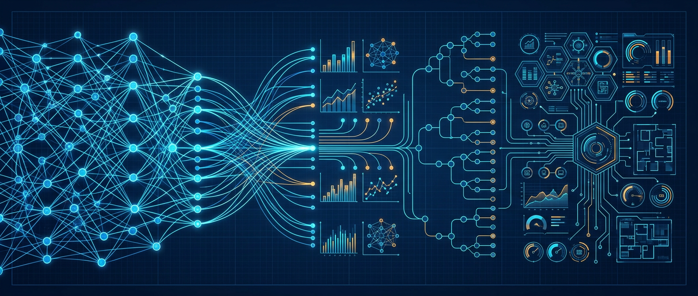
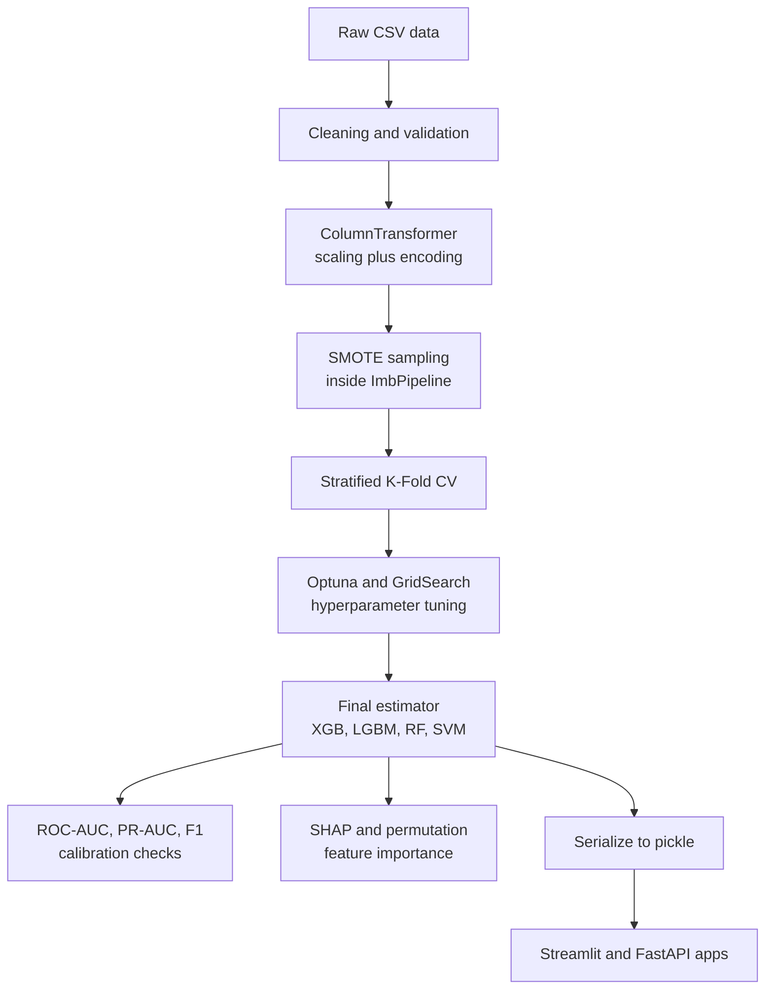

<p align="center">
  
</p>

# 🧠 AI-ML Blueprint

### From Math Foundations to Production AI Systems — a 374-Day AI/ML Engineering Roadmap, Built in Public

<p align="left">
  <a href="https://www.python.org/"></a>
  <a href="#index"></a>
  <a href="#roadmap"></a>
  <a href="#projects"></a>
  <a href="https://github.com/Sahil-K-Y/AI-ML-Blueprint/commits"></a>
  <a href="#license"></a>
</p>

> A single repository documenting the complete journey from **regression math** to **agentic AI systems** — every algorithm implemented, every concept visualized, every phase shipped as a working project.

This is my structured, day-by-day execution of a **374-day AI/ML Engineer curriculum**: 15 phases covering Classical ML → Deep Learning → Computer Vision → NLP & Transformers → MLOps → Generative AI & RAG → Agentic AI → Reinforcement Learning, ending in a flagship **Enterprise AI System capstone**. Each day produces a runnable notebook combining **intuition → mathematics → implementation**.

---

## 📑 Table of Contents

- [✨ Highlights](#highlights)
- [🎯 Who Is This For?](#who-for)
- [🧭 The Learning Journey](#journey)
- [🗺️ Roadmap at a Glance](#roadmap)
- [📚 Phase Guide](#phases)
- [📓 Complete Notebook Index](#index)
- [🏆 Featured Projects](#projects)
- [🧪 Benchmarks & Results](#benchmarks)
- [🎨 Interactive Visualizers](#visualizers)
- [🛠️ Tech Stack](#stack)
- [🗂️ Datasets Used](#datasets)
- [🚀 Getting Started](#getting-started)
- [📁 Repository Structure](#structure)
- [📏 How This Repo Is Built](#methodology)
- [🎓 Skills Matrix](#skills)
- [📐 Math Glossary](#math)
- [💼 Interview Prep Guide](#interviews)
- [📊 Current Progress & What's Next](#progress)
- [🗓️ Milestones](#milestones)
- [📖 Resources](#resources)
- [❓ FAQ](#faq)
- [🤝 Contributing](#contributing)
- [🙏 Acknowledgements](#thanks)
- [👨‍💻 Author](#author)
- [📈 Repo Stats](#stats)
- [📄 License](#license)

---

<a id="highlights"></a>
## ✨ Highlights

| | |
|---|---|
| 📓 | **87 hands-on notebooks** — each one a self-contained lesson with theory, math derivations, and runnable code |
| 🏆 | **3 deployed-style ML apps** (Streamlit) — Churn Intelligence, Titanic Survival, House Price Prediction |
| 🎨 | **2 interactive web visualizers** — animated Boosting & Advanced-ML masterclasses built with HTML/CSS/JS |
| 🗺️ | **Full 374-day curriculum** in [`roadmap_v3.md`](roadmap_v3.md) — phases, daily tasks, outputs, and 8 portfolio projects |
| 🔬 | **Math-first approach** — Gini/Entropy, gradient descent, XGBoost similarity scores, LSTM gates, attention — all derived, not just imported |
| 🏭 | **Production mindset** — Pipelines, ColumnTransformers, SMOTE without leakage, Optuna tuning, SHAP explainability, FastAPI/Docker patterns |
| ✅ | **Verified results** — every reported metric is traceable to stored notebook outputs (see [Benchmarks](#benchmarks)) |

---

<a id="who-for"></a>
## 🎯 Who Is This For?

| If you are a… | Start here… |
|---|---|
| 💼 **Recruiter / hiring manager** | Skim [Featured Projects](#projects) and [Benchmarks](#benchmarks) — 3 working ML apps with real metrics, then check the [Skills Matrix](#skills) for role fit |
| 📖 **Self-learner** | Follow the [Notebook Index](#index) in numbered order (`001 → 081 …`) — one notebook per day, exactly as the roadmap prescribes |
| 🎤 **Interview candidate** | Jump to the [Interview Prep Guide](#interviews) — every classic ML interview topic mapped to the notebook that teaches it |
| 🤝 **Peer / contributor** | See [Contributing](#contributing) — math corrections, cleaner explanations, and better visualizations are all welcome |

---

<a id="journey"></a>
## 🧭 The Learning Journey


```mermaid
flowchart LR
    P0[Phase 0<br/>EDA and Features] --> P1[Phase 1<br/>Linear Regression]
    P1 --> P2[Phase 2<br/>Classification]
    P2 --> P3[Phase 3<br/>Trees and SVM]
    P3 --> P4[Phase 4<br/>Boosting]
    P4 --> P5[Phase 5<br/>Unsupervised]
    P5 --> P6[Phase 6<br/>Deep Learning]
    P6 --> P79[Phases 7 to 9<br/>CV, Sequences, NLP]
    P79 --> P10[Phase 10<br/>MLOps]
    P10 --> P1112[Phases 11 to 12<br/>GenAI and Agents]
    P1112 --> P1314[Phases 13 to 14<br/>RL and Capstone]
    style P0 fill:#16a34a,color:#fff
    style P1 fill:#16a34a,color:#fff
    style P2 fill:#16a34a,color:#fff
    style P3 fill:#16a34a,color:#fff
    style P4 fill:#16a34a,color:#fff
    style P5 fill:#d97706,color:#fff
    style P6 fill:#d97706,color:#fff
```

🟩 Complete &nbsp;&nbsp; 🟧 In progress &nbsp;&nbsp; ⬜ Planned — see the [full day-by-day plan](roadmap_v3.md).

---

<a id="roadmap"></a>
## 🗺️ Roadmap at a Glance

| Phase | Focus Area | Days | Notebooks | Status |
|---|---|---|---|---|
| [Phase 0](Phase-0%20-%20EDA%20&%20Feature%20Engineering) — EDA & Feature Engineering | Data cleaning, univariate/bivariate/multivariate analysis, encoding, scaling, skew | Foundations | 16 | ✅ Complete |
| [Phase 1](Phase-1%20-%20Linear%20Regression%20&%20Regularization) — Linear Regression & Regularization | MSE, gradient descent, Ridge/Lasso/ElasticNet, SGD, House Price project | 001–013 | 13 | ✅ Complete |
| [Phase 2](Phase-2%20-%20Logistic%20Regression%20&%20Classification) — Logistic Regression & Classification | Sigmoid, Softmax, ROC-AUC/PR-AUC, OvR vs OvO, Breast Cancer project | 014–021 | 8 | ✅ Complete |
| [Phase 3](Phase-3%20-%20Tree%20Models%20&%20SVM) — Tree Models & SVM | Decision trees, pruning, SVM kernels, Naive Bayes, KNN, Random Forest | 022–038 | 18 | ✅ Complete |
| [Phase 4](Phase-4%20-%20Boosting%20&%20Advanced%20Ensembles) — Boosting & Advanced Ensembles | AdaBoost, GBM, XGBoost, LightGBM, CatBoost, Optuna, SHAP, calibration | 039–056 | 15 | ✅ Complete |
| [Phase 5](Phase-5%20-%20Unsupervised%20Learning) — Unsupervised Learning | K-Means, hierarchical, DBSCAN, GMM, PCA, t-SNE/UMAP, time series | 057–077 | 13 | 🔄 In Progress |
| [Phase 6](Phase-6%20-%20Deep%20Learning%20&%20PyTorch) — Deep Learning & PyTorch | Perceptrons, MLPs, activations, loss functions → backprop, PyTorch, FastAPI | 078–122 | 4 | 🔄 In Progress |
| Phase 7 — Computer Vision & Multimodal AI | CNNs, ResNet, YOLOv8, U-Net, ViT, Grad-CAM | 123–164 | — | 📋 Planned |
| Phase 8 — Sequence Models & Recommenders | RNNs, LSTM/GRU, attention, collaborative filtering, NDCG | 165–189 | — | 📋 Planned |
| Phase 9 — NLP & Transformers | BERT, GPT, Hugging Face fine-tuning, NER, QA, summarization | 190–238 | — | 📋 Planned |
| Phase 10 — MLOps & Data Engineering | Docker, MLflow, DVC, CI/CD, drift monitoring, A/B testing | 239–267 | — | 📋 Planned |
| Phase 11 — Generative AI & RAG | LLMs, vector DBs, hybrid search, LoRA/QLoRA, RAGAS | 268–316 | — | 📋 Planned |
| Phase 12 — Agentic AI Systems | LangGraph, multi-agent supervisors, HITL, MCP | 317–344 | — | 📋 Planned |
| Phase 13 — Reinforcement Learning | MDPs, Bellman equations, Q-learning, DQN, PPO | 345–358 | — | 📋 Planned |
| Phase 14 — LLMOps & Capstone | Observability, guardrails, responsible AI, Enterprise AI capstone | 359–374 | — | 📋 Planned |

📖 **Full day-by-day curriculum** with tasks, topics, and outputs: [`roadmap_v3.md`](roadmap_v3.md)

---

<a id="phases"></a>
## 📚 Phase Guide

<details>
<summary><b>Phase 0 — EDA & Feature Engineering</b> (16 notebooks) — <i>click to expand</i></summary>

<br>

Foundations of working with real data: cleaning, exploration, and preprocessing pipelines.

- Seaborn revision & advanced statistical plots
- Handling missing values, outlier detection (IQR, Z-score), skewed data
- Univariate, bivariate & multivariate analysis
- Feature encoding, scaling, creation + train/test split & cross-validation
- Capstones: Titanic EDA + Feature Engineering end-to-end

📁 [`Phase-0 - EDA & Feature Engineering`](Phase-0%20-%20EDA%20&%20Feature%20Engineering)

</details>

<details>
<summary><b>Phase 1 — Linear Regression & Regularization</b> (Days 001–013) — <i>click to expand</i></summary>

<br>

Regression from first principles to a shipped mini-app.

- Cost function (MSE), gradient descent dynamics & learning rates
- Simple/multiple/polynomial regression, OLS assumptions, VIF
- Ridge (L2), Lasso (L1), Elastic Net, SGDRegressor
- **Project:** California House Price Predictor — pipeline + [Streamlit app](Phase-1%20-%20Linear%20Regression%20&%20Regularization/house_app.py) (Lasso, R² tracked live)

📁 [`Phase-1 - Linear Regression & Regularization`](Phase-1%20-%20Linear%20Regression%20&%20Regularization)

</details>

<details>
<summary><b>Phase 2 — Logistic Regression & Classification</b> (Days 014–021) — <i>click to expand</i></summary>

<br>

The complete binary & multiclass classification toolkit.

- Sigmoid, odds ratios, log-loss formulation
- Accuracy, precision, recall, F1 + confusion-matrix thinking
- OvR vs OvO, Softmax regression, cross-entropy
- ROC-AUC & PR-AUC curves, threshold sweeps, regularization (`C`, L1/L2)
- **Project:** Breast Cancer Classification with StratifiedKFold validation

📁 [`Phase-2 - Logistic Regression & Classification`](Phase-2%20-%20Logistic%20Regression%20&%20Classification)

</details>

<details>
<summary><b>Phase 3 — Tree Models & SVM</b> (Days 022–038) — <i>click to expand</i></summary>

<br>

Non-linear models, kernels, and the first ensembles.

- Decision trees: Gini, entropy, information gain, pruning (`ccp_alpha`), regressors
- SVM: margins, support vectors, linear/poly/RBF kernels, `C` & `gamma` tuning
- Naive Bayes (Gaussian/Multinomial, Laplace smoothing), KNN (metrics, scaling, boundaries)
- Voting, bagging, OOB scores → Random Forest + Optuna tuning
- Model leaderboard benchmark + feature importance (MDI vs permutation)

📁 [`Phase-3 - Tree Models & SVM`](Phase-3%20-%20Tree%20Models%20&%20SVM)

</details>

<details>
<summary><b>Phase 4 — Boosting & Advanced Ensembles</b> (Days 039–056) — <i>click to expand</i></summary>

<br>

The gradient-boosting deep dive + production-grade classical ML.

- AdaBoost (exponential loss, sample reweighting), GBM residual fitting from scratch
- **XGBoost:** regularized objective, similarity scores, exact vs histogram splits, `gamma` pruning
- **LightGBM:** leaf-wise growth, GOSS, EFB, native categoricals — **CatBoost:** symmetric trees, ordered boosting
- Optuna tuning, leakage-proof CV, learning curves, RFE/feature selection
- **Masterclass (050–056):** sklearn Pipelines, SMOTE/ADASYN, calibration, SHAP & LIME, anomaly detection, full benchmark lab
- Includes an [interactive masterclass website](Phase-4%20-%20Boosting%20&%20Advanced%20Ensembles/masterclass_web/index.html) with math + charts

📁 [`Phase-4 - Boosting & Advanced Ensembles`](Phase-4%20-%20Boosting%20&%20Advanced%20Ensembles)

</details>

<details>
<summary><b>Phase 5 — Unsupervised Learning</b> (Days 057–077, in progress) — <i>click to expand</i></summary>

<br>

Finding structure without labels, plus time-series forecasting.

- K-Means (Lloyd's, K-Means++, elbow, silhouette) + hands-on companion lab
- Hierarchical clustering & dendrograms, DBSCAN/HDBSCAN, GMM with EM, AIC/BIC selection
- PCA from scratch (eigendecomposition), t-SNE/UMAP visualization
- Association rules (Apriori, support/confidence/lift), clustering evaluation (ARI, NMI)
- Time series: master course (Parts 1–8, decomposition → SARIMA → XGBoost → Prophet), 31-section theory guide, hands-on starters

📁 [`Phase-5 - Unsupervised Learning`](Phase-5%20-%20Unsupervised%20Learning)

</details>

<details>
<summary><b>Phase 6 — Deep Learning & PyTorch</b> (Days 078–122, in progress) — <i>click to expand</i></summary>

<br>

Neural networks from math to production PyTorch pipelines.

- Perceptrons, the XOR problem, MLPs, activations (Sigmoid → ReLU → GELU)
- Forward propagation math, loss functions (MSE, BCE, categorical CE)
- Coming next: backpropagation derivations, NumPy MLP from scratch, optimizers (Adam/AdamW), PyTorch training loops, WandB, FastAPI + Docker deployment

📁 [`Phase-6 - Deep Learning & PyTorch`](Phase-6%20-%20Deep%20Learning%20&%20PyTorch)

</details>

---

<a id="index"></a>
## 📓 Complete Notebook Index

Every notebook in the repository, one line each. Open any file directly on GitHub — most render with outputs inline.

<!-- total notebooks indexed: 89 -->
<details>
<summary><b>Phase 0 - EDA and Feature Engineering</b> (16 notebooks) - <i>click to expand</i></summary>

| No. | Notebook | Covers |
|---|---|---|
| `001` | [001 - Seaborn Revision](Phase-0%20-%20EDA%20&%20Feature%20Engineering/001%20-%20Seaborn%20Revision.ipynb) | Core Seaborn plots: distributions, relationships, categoricals |
| `002` | [002 - Seaborn Advanced](Phase-0%20-%20EDA%20&%20Feature%20Engineering/002%20-%20Seaborn%20Advanced.ipynb) | FacetGrids, pairplots, heatmaps, styling for publication plots |
| `003` | [003 - EDA Intro](Phase-0%20-%20EDA%20&%20Feature%20Engineering/003%20-%20EDA%20Intro.ipynb) | The EDA workflow: questions, profiling, visualization first pass |
| `004` | [004 - Handling Missing Values](Phase-0%20-%20EDA%20&%20Feature%20Engineering/004%20-%20Handling%20Missing%20Values.ipynb) | Detection, MCAR/MAR/MNAR patterns, deletion vs imputation |
| `005` | [005 - Outlier Detection](Phase-0%20-%20EDA%20&%20Feature%20Engineering/005%20-%20Outlier%20Detection.ipynb) | IQR fences, Z-scores, boxplots, treatment decisions |
| `006` | [006 - Univariate Analysis](Phase-0%20-%20EDA%20&%20Feature%20Engineering/006%20-%20Univariate%20Analysis.ipynb) | Single-variable deep dive: skew, kurtosis, counts, modes |
| `007` | [007 - Bivariate Analysis](Phase-0%20-%20EDA%20&%20Feature%20Engineering/007%20-%20Bivariate%20Analysis.ipynb) | Two-variable links: correlation, crosstabs, grouped plots |
| `008` | [008 - Multivariate Analysis](Phase-0%20-%20EDA%20&%20Feature%20Engineering/008%20-%20Multivariate%20Analysis.ipynb) | Three-plus variables: pairplots, facets, interactions |
| `009` | [009 - Data Cleaning Pipeline](Phase-0%20-%20EDA%20&%20Feature%20Engineering/009%20-%20Data%20Cleaning%20Pipeline.ipynb) | A reproducible cleaning workflow from raw to trusted data |
| `010` | [010 - EDA Capstone Titanic](Phase-0%20-%20EDA%20&%20Feature%20Engineering/010%20-%20EDA%20Capstone%20Titanic.ipynb) | Capstone: full Titanic exploratory analysis |
| `011` | [011 - Feature Encoding](Phase-0%20-%20EDA%20&%20Feature%20Engineering/011%20-%20Feature%20Encoding.ipynb) | One-hot, ordinal, label and target encoding compared |
| `012` | [012 - Feature Scaling](Phase-0%20-%20EDA%20&%20Feature%20Engineering/012%20-%20Feature%20Scaling.ipynb) | Standard, min-max and robust scaling, and when each fits |
| `013` | [013 - Handling Skewed Data](Phase-0%20-%20EDA%20&%20Feature%20Engineering/013%20-%20Handling%20Skewed%20Data.ipynb) | Log, Box-Cox and Yeo-Johnson transforms for skew |
| `014` | [014 - Feature Creation](Phase-0%20-%20EDA%20&%20Feature%20Engineering/014%20-%20Feature%20Creation.ipynb) | Binning, interactions, datetime and domain features |
| `015` | [015 - Train Test Split & CV](Phase-0%20-%20EDA%20&%20Feature%20Engineering/015%20-%20Train%20Test%20Split%20&%20CV.ipynb) | Splits, stratification, K-fold, leakage awareness |
| `016` | [016 - Feature Engineering Capstone](Phase-0%20-%20EDA%20&%20Feature%20Engineering/016%20-%20Feature%20Engineering%20Capstone.ipynb) | Capstone: raw dataset to model-ready features |

</details>

<details>
<summary><b>Phase 1 - Linear Regression and Regularization (Days 001-013)</b> (13 notebooks) - <i>click to expand</i></summary>

| No. | Notebook | Covers |
|---|---|---|
| `001` | [001 - Cost Function MSE](Phase-1%20-%20Linear%20Regression%20&%20Regularization/001%20-%20Cost%20Function%20MSE.ipynb) | Residuals, MSE math, cost curves, why squaring works |
| `002` | [002 - Gradient Descent](Phase-1%20-%20Linear%20Regression%20&%20Regularization/002%20-%20Gradient%20Descent.ipynb) | Learning rates, convergence, batch update dynamics |
| `003` | [003 - Linear Regression Implementation](Phase-1%20-%20Linear%20Regression%20&%20Regularization/003%20-%20Linear%20Regression%20Implementation.ipynb) | Normal equation, coefficients, fitting and predicting |
| `004` | [004 - Model Evaluation](Phase-1%20-%20Linear%20Regression%20&%20Regularization/004%20-%20Model%20Evaluation.ipynb) | R2, adjusted R2, MAE, MSE, RMSE from first principles |
| `005` | [005 - Multiple Linear Regression](Phase-1%20-%20Linear%20Regression%20&%20Regularization/005%20-%20Multiple%20Linear%20Regression.ipynb) | OLS assumptions, multicollinearity, VIF checks |
| `006` | [006 - Polynomial Regression](Phase-1%20-%20Linear%20Regression%20&%20Regularization/006%20-%20Polynomial%20Regression.ipynb) | PolynomialFeatures, non-linear fits, spotting overfitting |
| `007` | [007 - Ridge & Lasso Regression](Phase-1%20-%20Linear%20Regression%20&%20Regularization/007%20-%20Ridge%20&%20Lasso%20Regression.ipynb) | L1/L2 penalties, alpha shrinkage paths compared |
| `008` | [008 - Elastic Net Regression](Phase-1%20-%20Linear%20Regression%20&%20Regularization/008%20-%20Elastic%20Net%20Regression.ipynb) | Combined penalty, l1_ratio tuning, grouped selection |
| `009` | [009 - SGD Regressor](Phase-1%20-%20Linear%20Regression%20&%20Regularization/009%20-%20SGD%20Regressor.ipynb) | Stochastic updates, partial_fit, large-scale training |
| `010` | [010 - App Planning](Phase-1%20-%20Linear%20Regression%20&%20Regularization/010%20-%20App%20Planning.ipynb) | UI spec and serialization plan for the regression mini app |
| `011` | [011 - House Price Prediction Project](Phase-1%20-%20Linear%20Regression%20&%20Regularization/011%20-%20House%20Price%20Prediction%20Project.ipynb) | Ingestion, EDA, encoding, tuning on housing data |
| `012` | [012 - Simple UI Integration](Phase-1%20-%20Linear%20Regression%20&%20Regularization/012%20-%20Simple%20UI%20Integration.ipynb) | Sliders, inputs and live prediction callbacks |
| `013` | [013 - Regression Mini Project Polish](Phase-1%20-%20Linear%20Regression%20&%20Regularization/013%20-%20Regression%20Mini%20Project%20Polish.ipynb) | Final pipeline, styling, validation, deployment tests |

</details>

<details>
<summary><b>Phase 2 - Logistic Regression and Classification (Days 014-021)</b> (8 notebooks) - <i>click to expand</i></summary>

| No. | Notebook | Covers |
|---|---|---|
| `014` | [014 - Logistic Regression Intuition & Sigmoid](Phase-2%20-%20Logistic%20Regression%20&%20Classification/014%20-%20Logistic%20Regression%20Intuition%20&%20Sigmoid.ipynb) | Sigmoid, odds, log-odds, log-loss formulation |
| `015` | [015 - Logistic Regression Implementation & Metrics](Phase-2%20-%20Logistic%20Regression%20&%20Classification/015%20-%20Logistic%20Regression%20Implementation%20&%20Metrics.ipynb) | Training plus accuracy, precision, recall, F1 |
| `016` | [016 - Multiclass Classification (OvR vs OvO)](Phase-2%20-%20Logistic%20Regression%20&%20Classification/016%20-%20Multiclass%20Classification%20%28OvR%20vs%20OvO%29.ipynb) | One-vs-Rest vs One-vs-One strategies and boundaries |
| `017` | [017 - Softmax Regression](Phase-2%20-%20Logistic%20Regression%20&%20Classification/017%20-%20Softmax%20Regression.ipynb) | Softmax probabilities, cross-entropy, temperature |
| `018` | [018 - ROC-AUC & PR-AUC Curves](Phase-2%20-%20Logistic%20Regression%20&%20Classification/018%20-%20ROC-AUC%20&%20PR-AUC%20Curves.ipynb) | Threshold sweeps, ROC vs PR for imbalanced data |
| `019` | [019 - Multiclass Pipeline & Evaluation](Phase-2%20-%20Logistic%20Regression%20&%20Classification/019%20-%20Multiclass%20Pipeline%20&%20Evaluation.ipynb) | Pipelines, scaling, reports, macro/micro averaging |
| `020` | [020 - Regularization in Logistic Regression](Phase-2%20-%20Logistic%20Regression%20&%20Classification/020%20-%20Regularization%20in%20Logistic%20Regression.ipynb) | C sweeps, L1/L2 shrinkage, sparse selections |
| `021` | [021 - Breast Cancer Classification Project](Phase-2%20-%20Logistic%20Regression%20&%20Classification/021%20-%20Breast%20Cancer%20Classification%20Project.ipynb) | StratifiedKFold pipeline project with metric logs |

</details>

<details>
<summary><b>Phase 3 - Tree Models and SVM (Days 022-038)</b> (18 notebooks) - <i>click to expand</i></summary>

| No. | Notebook | Covers |
|---|---|---|
| `022` | [022 - Decision Tree Intuition](Phase-3%20-%20Tree%20Models%20&%20SVM/022%20-%20Decision%20Tree%20Intuition.ipynb) | Gini impurity, entropy, information gain splits |
| `023` | [023 - Decision Tree Implementation](Phase-3%20-%20Tree%20Models%20&%20SVM/023%20-%20Decision%20Tree%20Implementation.ipynb) | DecisionTreeClassifier, depth control, visualization |
| `024` | [024 - Decision Tree Pruning](Phase-3%20-%20Tree%20Models%20&%20SVM/024%20-%20Decision%20Tree%20Pruning.ipynb) | Overfitting, ccp_alpha pruning, validation curves |
| `025` | [025 - Decision Tree Regressor](Phase-3%20-%20Tree%20Models%20&%20SVM/025%20-%20Decision%20Tree%20Regressor.ipynb) | Regression trees, variance reduction splits |
| `026` | [026 - SVM Intuition](Phase-3%20-%20Tree%20Models%20&%20SVM/026%20-%20SVM%20Intuition.ipynb) | Margins, support vectors, slack, the C tradeoff |
| `027` | [027 - SVM Kernels](Phase-3%20-%20Tree%20Models%20&%20SVM/027%20-%20SVM%20Kernels.ipynb) | Linear, polynomial and RBF kernels, the kernel trick |
| `028` | [028 - SVM Tuning](Phase-3%20-%20Tree%20Models%20&%20SVM/028%20-%20SVM%20Tuning.ipynb) | GridSearchCV over C and gamma with cross-validation |
| `028` | [028b - SVM Extra Practice](Phase-3%20-%20Tree%20Models%20&%20SVM/028b%20-%20SVM%20Extra%20Practice.ipynb) | Extra SVM drills on boundaries and parameters |
| `029` | [029 - Naive Bayes](Phase-3%20-%20Tree%20Models%20&%20SVM/029%20-%20Naive%20Bayes.ipynb) | Bayes theorem, Gaussian/Multinomial NB, Laplace smoothing |
| `030` | [030 - KNN Basics](Phase-3%20-%20Tree%20Models%20&%20SVM/030%20-%20KNN%20Basics.ipynb) | Neighbor voting, Euclidean/Manhattan distance, choosing K |
| `031` | [031 - KNN Implementation](Phase-3%20-%20Tree%20Models%20&%20SVM/031%20-%20KNN%20Implementation.ipynb) | Scaling needs, boundary plots, K optimization |
| `032` | [032 - Model Leaderboard](Phase-3%20-%20Tree%20Models%20&%20SVM/032%20-%20Model%20Leaderboard.ipynb) | Every classifier benchmarked on shared splits |
| `033` | [033 - Classification Project](Phase-3%20-%20Tree%20Models%20&%20SVM/033%20-%20Classification%20Project.ipynb) | Baselines to candidate evaluation pipeline |
| `034` | [034 - Voting Bagging Ensembles](Phase-3%20-%20Tree%20Models%20&%20SVM/034%20-%20Voting%20Bagging%20Ensembles.ipynb) | Hard/soft voting, bagging, out-of-bag scores |
| `035` | [035 - Random Forest Basics](Phase-3%20-%20Tree%20Models%20&%20SVM/035%20-%20Random%20Forest%20Basics.ipynb) | Bootstrap aggregation plus random subspaces |
| `036` | [036 - Random Forest Tuning](Phase-3%20-%20Tree%20Models%20&%20SVM/036%20-%20Random%20Forest%20Tuning.ipynb) | Optuna search over trees, depth and splits |
| `037` | [037 - Feature Importance](Phase-3%20-%20Tree%20Models%20&%20SVM/037%20-%20Feature%20Importance.ipynb) | MDI vs permutation importance compared |
| `038` | [038 - Trees SVM Assessment](Phase-3%20-%20Tree%20Models%20&%20SVM/038%20-%20Trees%20SVM%20Assessment.ipynb) | Interview-style assessment questions and answers |

</details>

<details>
<summary><b>Phase 4 - Boosting and Advanced Ensembles (Days 039-056)</b> (15 notebooks) - <i>click to expand</i></summary>

| No. | Notebook | Covers |
|---|---|---|
| `039` | [039 - AdaBoost](Phase-4%20-%20Boosting%20&%20Advanced%20Ensembles/039%20-%20AdaBoost.ipynb) | Adaptive boosting, exponential loss, decision stumps |
| `040` | [040_gradient_boosting](Phase-4%20-%20Boosting%20&%20Advanced%20Ensembles/040_gradient_boosting.ipynb) | Residual-fitting math plus a from-scratch GBM |
| `041` | [041_adaboost_deepdive](Phase-4%20-%20Boosting%20&%20Advanced%20Ensembles/041_adaboost_deepdive.ipynb) | Weight-update derivations plus sklearn lab |
| `042` | [042_xgboost_practice](Phase-4%20-%20Boosting%20&%20Advanced%20Ensembles/042_xgboost_practice.ipynb) | Regularized objective, similarity, gain, DMatrix API |
| `043` | [043_lightgbm_practice](Phase-4%20-%20Boosting%20&%20Advanced%20Ensembles/043_lightgbm_practice.ipynb) | Leaf-wise growth, GOSS, EFB, native categoricals |
| `44` | [44_catboost_benchmark](Phase-4%20-%20Boosting%20&%20Advanced%20Ensembles/44_catboost_benchmark.ipynb) | Symmetric trees, ordered boosting, GBM benchmark |
| `045` | [045_optuna_tuning](Phase-4%20-%20Boosting%20&%20Advanced%20Ensembles/045_optuna_tuning.ipynb) | Grid and random search to Optuna studies with pruning |
| `046` | [046_cv_leakage_prevention](Phase-4%20-%20Boosting%20&%20Advanced%20Ensembles/046_cv_leakage_prevention.ipynb) | K-fold, stratification, TimeSeriesSplit, leakage checklist |
| `047` | [047_learning_curves](Phase-4%20-%20Boosting%20&%20Advanced%20Ensembles/047_learning_curves.ipynb) | Bias-variance diagnosis and mitigation strategies |
| `048` | [048_feature_engineering](Phase-4%20-%20Boosting%20&%20Advanced%20Ensembles/048_feature_engineering.ipynb) | Imputation, outliers, encoding, power transforms |
| `049` | [049_feature_selection](Phase-4%20-%20Boosting%20&%20Advanced%20Ensembles/049_feature_selection.ipynb) | Filter, wrapper (RFE) and embedded selection |
| `050` | [050_056_advanced_ml_masterclass](Phase-4%20-%20Boosting%20&%20Advanced%20Ensembles/050_056_advanced_ml_masterclass.ipynb) | Pipelines, SMOTE, calibration, SHAP/LIME, anomalies, benchmark |
| `53` | [53](Phase-4%20-%20Boosting%20&%20Advanced%20Ensembles/53.ipynb) | Day 053 lab: SHAP and LIME explainability |
| `Lab` | [customer_churn](Phase-4%20-%20Boosting%20&%20Advanced%20Ensembles/customer_churn.ipynb) | Applied lab: boosting models on churn data |
| `Lab` | [lightgb](Phase-4%20-%20Boosting%20&%20Advanced%20Ensembles/lightgb.ipynb) | Extra LightGBM practice lab |

</details>

<details>
<summary><b>Phase 5 - Unsupervised Learning (Days 057+, in progress)</b> (13 notebooks) - <i>click to expand</i></summary>

| No. | Notebook | Covers |
|---|---|---|
| `057` | [057_kmeans_clustering](Phase-5%20-%20Unsupervised%20Learning/057_kmeans_clustering.ipynb) | Structured Day 057: Lloyd's, K-Means++, elbow, silhouette |
| `057` | [057_kmeans_hands_on_lab](Phase-5%20-%20Unsupervised%20Learning/057_kmeans_hands_on_lab.ipynb) | Hands-on companion: executed K-Means exploration with plots |
| `058` | [058_hierarchical_dendrograms](Phase-5%20-%20Unsupervised%20Learning/058_hierarchical_dendrograms.ipynb) | Agglomerative merging, Ward linkage, dendrograms |
| `059` | [059_dbscan_hdbscan](Phase-5%20-%20Unsupervised%20Learning/059_dbscan_hdbscan.ipynb) | Core/border/noise points, eps tuning, HDBSCAN |
| `060` | [060_gmm_em_algorithm](Phase-5%20-%20Unsupervised%20Learning/060_gmm_em_algorithm.ipynb) | Soft clustering with EM, AIC/BIC selection |
| `061` | [061_pca_from_scratch](Phase-5%20-%20Unsupervised%20Learning/061_pca_from_scratch.ipynb) | Covariance, eigendecomposition, explained variance |
| `062` | [062_tsne_umap_viz](Phase-5%20-%20Unsupervised%20Learning/062_tsne_umap_viz.ipynb) | Perplexity, manifold learning, structure preservation |
| `063` | [063_association_rules](Phase-5%20-%20Unsupervised%20Learning/063_association_rules.ipynb) | Apriori/FP-Growth, support, confidence, lift |
| `064` | [064_clustering_eval_lab](Phase-5%20-%20Unsupervised%20Learning/064_clustering_eval_lab.ipynb) | ARI, NMI, silhouette, cluster profiling |
| `Lab` | [complete_ts](Phase-5%20-%20Unsupervised%20Learning/complete_ts.ipynb) | Hands-on starter: profiling Electric Production and shampoo data |
| `Lab` | [master_time_series](Phase-5%20-%20Unsupervised%20Learning/master_time_series.ipynb) | Master course Parts 1-8: theory plus forecasting exercises |
| `Lab` | [master_time_series_2](Phase-5%20-%20Unsupervised%20Learning/master_time_series_2.ipynb) | Course-format companion: Parts 1-8 theory plus stubs |
| `Lab` | [master_time_series_theory_guide](Phase-5%20-%20Unsupervised%20Learning/master_time_series_theory_guide.ipynb) | Complete prose reference: 31-section theory guide |

</details>

<details>
<summary><b>Phase 6 - Deep Learning and PyTorch (Days 078+, in progress)</b> (4 notebooks) - <i>click to expand</i></summary>

| No. | Notebook | Covers |
|---|---|---|
| `078` | [078_perceptron_xor](Phase-6%20-%20Deep%20Learning%20&%20PyTorch/078_perceptron_xor.ipynb) | Biological vs artificial neurons, the XOR limit |
| `079` | [079_mlp_activations](Phase-6%20-%20Deep%20Learning%20&%20PyTorch/079_mlp_activations.ipynb) | Hidden layers, Sigmoid to ReLU to GELU compared |
| `080` | [080_forward_prop_math](Phase-6%20-%20Deep%20Learning%20&%20PyTorch/080_forward_prop_math.ipynb) | Z = WX + b, shapes and mappings across layers |
| `081` | [081_loss_functions](Phase-6%20-%20Deep%20Learning%20&%20PyTorch/081_loss_functions.ipynb) | MSE, binary and categorical cross-entropy |

</details>

<details>
<summary><b>Project notebooks</b> (2 notebooks) - <i>click to expand</i></summary>

| No. | Notebook | Covers |
|---|---|---|
| `PRJ-1` | [churn prediction](End-to-End%20Customer%20Churn%20Prediction%20System/churn%20prediction.ipynb) | EDA, SMOTE pipeline and XGBoost tuning behind the churn app |
| `PRJ-2` | [Titanic](Titanic/Titanic.ipynb) | Titanic EDA plus five-model benchmark behind the survival app |

</details>

**Theory companions** (read alongside the notebooks):

- 📄 [advanced_ml_masterclass_050_056.md](Phase-4%20-%20Boosting%20&%20Advanced%20Ensembles/advanced_ml_masterclass_050_056.md) - Days 050-056 masterclass: pipelines, imbalance, calibration, XAI, anomalies
- 📄 [phase2_advanced_ml_theory_and_code.md](Phase-4%20-%20Boosting%20&%20Advanced%20Ensembles/phase2_advanced_ml_theory_and_code.md) - Boosting theory companion with math derivations and code patterns
- 📄 [Day 10 - App Planning.md](Phase-1%20-%20Linear%20Regression%20&%20Regularization/Day%2010%20-%20App%20Planning.md) - Streamlit app spec: UI design plus backend pipeline flow


---

<a id="projects"></a>
## 🏆 Featured Projects

Every project follows the same production-grade pipeline:


```mermaid
flowchart TB
    RAW[Raw CSV data] --> CLEAN[Cleaning and validation]
    CLEAN --> CT[ColumnTransformer<br/>scaling plus encoding]
    CT --> SM[SMOTE sampling<br/>inside ImbPipeline]
    SM --> CV[Stratified K-Fold CV]
    CV --> TUNE[Optuna and GridSearch<br/>hyperparameter tuning]
    TUNE --> MODEL[Final estimator<br/>XGB, LGBM, RF, SVM]
    MODEL --> EVAL[ROC-AUC, PR-AUC, F1<br/>calibration checks]
    MODEL --> XAI[SHAP and permutation<br/>feature importance]
    MODEL --> PKG[Serialize to pickle]
    PKG --> APP[Streamlit and FastAPI apps]
```

### 1. 🔮 Customer Churn Intelligence Platform
> End-to-end telecom churn prediction with risk scoring, batch CSV inference, and automated retention recommendations.

| | |
|---|---|
| 📁 | [`End-to-End Customer Churn Prediction System`](End-to-End%20Customer%20Churn%20Prediction%20System) |
| 🧠 | Tuned **XGBoost** + **SMOTE** inside a leakage-proof `ImbPipeline` (`ColumnTransformer` + `RandomizedSearchCV`, best: `n_estimators=200`, `max_depth=5`, `learning_rate=0.05`) |
| 📊 | **Accuracy 77.6% · ROC-AUC 0.840 · PR-AUC 0.650** (test set, see [Benchmarks](#benchmarks)) |
| 🖥️ | Dark-themed Streamlit app — single-customer scoring, bulk CSV upload/download, pipeline inspector |

```bash
cd "End-to-End Customer Churn Prediction System"
pip install -r requirements.txt
streamlit run app.py
```

### 2. 🚢 Titanic Survival Predictor
> Classic Kaggle problem, production treatment: model comparison, feature engineering, and a polished inference UI.

| | |
|---|---|
| 📁 | [`Titanic`](Titanic) |
| 🧠 | **SVM (RBF kernel)** selected after benchmarking LR, KNN, Decision Tree & Naive Bayes — engineered `Is_alone` feature, `StandardScaler` |
| 📊 | **Test accuracy ~81.6%** |
| 🖥️ | Streamlit app with input validation, prediction cards, and preprocessing transparency |

```bash
cd Titanic
pip install streamlit pandas numpy scikit-learn joblib
streamlit run app.py
```

### 3. 🏠 California House Price Predictor
> Phase 1 capstone — Lasso regression pipeline served through an interactive Streamlit interface.

| | |
|---|---|
| 📁 | [`Phase-1 - Linear Regression & Regularization/house_app.py`](Phase-1%20-%20Linear%20Regression%20&%20Regularization/house_app.py) |
| 🧠 | `StandardScaler` + **Lasso (α=0.001)** pipeline on the California Housing dataset |
| 🖥️ | Sidebar model specs (R² score computed live) + sliders/inputs for all 8 housing features |

```bash
cd "Phase-1 - Linear Regression & Regularization"
pip install streamlit scikit-learn
streamlit run house_app.py
```

---

<a id="benchmarks"></a>
## 🧪 Benchmarks & Results

All metrics below are taken from stored notebook outputs — re-run the notebooks to reproduce them exactly (`random_state=42` everywhere).

### Customer Churn — tuned XGBoost + SMOTE (test set, n=1,409)

| Metric | Score |
|---|---|
| Accuracy | **0.776** |
| ROC-AUC | **0.840** |
| PR-AUC (Average Precision) | **0.650** |
| F1 (churn class) | **0.60** (precision 0.57, recall 0.63) |

Confusion matrix (rows = actual, columns = predicted):

| | Pred: No Churn | Pred: Churn |
|---|---|---|
| **Actual: No Churn** | 859 | 176 |
| **Actual: Churn** | 140 | 234 |

> Source: `End-to-End Customer Churn Prediction System/churn prediction.ipynb` (tuned-evaluation cell). The model catches **63% of churners** at 57% precision — the right tradeoff when retention offers are cheap and churn is expensive.

### Titanic — 5-model benchmark (same splits)

| Model | Accuracy | F1 Score |
|---|---|---|
| Logistic Regression | 0.799 | 0.719 |
| KNN | 0.788 | 0.708 |
| Decision Tree | 0.821 | 0.761 |
| Naive Bayes | 0.788 | 0.721 |
| **SVM (RBF) — selected** | **0.816** | 0.718 |

> Source: `Titanic/Titanic.ipynb`. SVM chosen for the best accuracy–generalization balance; the full comparison lives in the notebook.

### Reproducibility notes
- Fixed `random_state=42` for splits, models, and samplers
- Stratified splits / `StratifiedKFold` for every classification task
- Preprocessing sealed inside `Pipeline`/`ColumnTransformer`; resampling inside `ImbPipeline` — no leakage into validation folds

---

<a id="visualizers"></a>
## 🎨 Interactive Visualizers

Static notes weren't enough for boosting — so these topics got full animated web experiences:

| Visualizer | What it covers | Open |
|---|---|---|
| 🔥 **Boosting Visualizer** | GB regression & classification step-by-step, XGBoost similarity/gain math, overfitting playground, leaf-wise vs level-wise growth, AdaBoost, model comparison | [`boosting-visualizer/index.html`](boosting-visualizer/index.html) |
| 📘 **Advanced ML Masterclass** | Days 050–056 companion site — pipelines, imbalance, calibration, SHAP/LIME, anomaly detection, with LaTeX math + Chart.js visuals | [`Phase-4 …/masterclass_web/index.html`](Phase-4%20-%20Boosting%20&%20Advanced%20Ensembles/masterclass_web/index.html) |

> Just open the `index.html` files in a browser — no build step required.

---

<a id="stack"></a>
## 🛠️ Tech Stack

| Category | Tools |
|---|---|
| **Languages** | Python, SQL (planned), HTML/CSS/JS (visualizers) |
| **Core ML** | scikit-learn, XGBoost, LightGBM, CatBoost, imbalanced-learn |
| **Deep Learning** | PyTorch (in progress), NumPy-based from-scratch implementations |
| **Experimentation** | Optuna, MLflow / WandB (planned) |
| **Explainability** | SHAP, LIME, permutation importance |
| **Data & Viz** | pandas, NumPy, Matplotlib, Seaborn, mlxtend |
| **Apps & Serving** | Streamlit, FastAPI (planned), Docker (planned) |
| **MLOps (planned)** | DVC, GitHub Actions, Evidently, Hugging Face Hub |

---

<a id="datasets"></a>
## 🗂️ Datasets Used

| Dataset | Size | Used in |
|---|---|---|
| 🚢 Titanic (`train.csv`) | 891 passengers × 12 cols | Phase 0 capstone, Titanic project |
| 📞 Telco Customer Churn (IBM sample) | 7,043 customers × 21 cols | Churn Intelligence project |
| 🏠 California Housing (via `sklearn.datasets`) | 20,640 districts × 8 features | Phase 1 project + app |
| 🎗️ Breast Cancer Wisconsin (via `sklearn.datasets`) | 569 cases × 30 features | Phase 2 project |
| 📝 Phase-2 practice set (`train.csv`) | 50-row teaching set | Classification drills |
| ⚡ Electric Production | 397 monthly records | Phase 5 time-series labs |
| 🌡️ Daily Minimum Temperatures | 3,650 daily records | Phase 5 time-series labs |
| 🍺 Monthly Beer Production | 476 monthly records | Phase 5 time-series labs |
| 🧴 Shampoo Sales | 36 monthly records | Phase 5 time-series labs |

> Large/derived files stay out of Git per [`.gitignore`](.gitignore); anything committed is small enough to clone comfortably.

---

<a id="getting-started"></a>
## 🚀 Getting Started

### Prerequisites
- **Python 3.10+**
- `pip` or `conda`, and Git
- No GPU needed — everything through Phase 5 runs on CPU

### 1. Clone the repository
```bash
git clone https://github.com/Sahil-K-Y/AI-ML-Blueprint.git
cd AI-ML-Blueprint
```

### 2. Create a virtual environment (recommended)
```bash
python -m venv .venv
# Windows
.venv\Scripts\activate
# macOS / Linux
source .venv/bin/activate
```

### 3. Install dependencies
```bash
pip install -r requirements.txt
```

### 4. Explore the notebooks
```bash
jupyter notebook
```
Start with [`Phase-0 - EDA & Feature Engineering`](Phase-0%20-%20EDA%20&%20Feature%20Engineering) and follow the numbered sequence (`001 → 081 …`) — each notebook is one day of the roadmap.

### 5. Run the apps
Each project folder has its own README with instructions — e.g.:
```bash
cd "End-to-End Customer Churn Prediction System" && streamlit run app.py
```

---

<a id="structure"></a>
## 📁 Repository Structure

```text
AI-ML-Blueprint/
│
├── 🖼️ assets/banner.png                        # Repo banner
├── 📖 roadmap_v3.md                            # Master 374-day curriculum (phases, daily tasks, 8 projects)
├── 📋 requirements.txt                         # Core Python dependencies
├── 📄 LICENSE                                  # MIT license
│
├── 📊 Phase-0 - EDA & Feature Engineering/     # 16 notebooks: cleaning → EDA → preprocessing
├── 📈 Phase-1 - Linear Regression & Regularization/      # Days 001–013 + house price app
├── 🎯 Phase-2 - Logistic Regression & Classification/    # Days 014–021 + metrics deep dives
├── 🌳 Phase-3 - Tree Models & SVM/             # Days 022–038 + ensembles & leaderboard
├── 🔥 Phase-4 - Boosting & Advanced Ensembles/           # Days 039–056 + masterclass site
├── 🌀 Phase-5 - Unsupervised Learning/         # Days 057–064 + TS masters (in progress)
├── 🧬 Phase-6 - Deep Learning & PyTorch/       # Days 078–081 (in progress)
│
├── 🔮 End-to-End Customer Churn Prediction System/       # XGBoost + SMOTE + Streamlit
│   ├── app.py · churn prediction.ipynb · churn_model.pkl · requirements.txt
├── 🚢 Titanic/                                 # SVM survival predictor + Streamlit app
│   └── app.py · Titanic.ipynb · SVM.pkl · scaler.pkl · columns.pkl
└── 🎨 boosting-visualizer/                     # Interactive boosting animations (HTML/CSS/JS)
```

---

<a id="methodology"></a>
## 📏 How This Repo Is Built

- **One day = one notebook** — numbered (`001`, `002`, …) so the learning order is always obvious.
- **Intuition → Math → Code** — every algorithm is motivated visually, derived mathematically, then implemented (often from scratch before using the library).
- **No leakage, ever** — preprocessing lives inside `Pipeline`/`ColumnTransformer`; resampling inside `ImbPipeline`; scaling fit on train only.
- **Compare, don't just fit** — leaderboard notebooks benchmark every candidate model on the same splits before selecting one.
- **Ship it** — phases end in runnable artifacts: Streamlit apps, saved pipelines (`.pkl`/`.joblib`), or interactive sites.
- **Verify, don't trust** — reported metrics come from stored cell outputs; app display text is cross-checked against training code.

---

<a id="skills"></a>
## 🎓 Skills Matrix

What each completed phase makes you able to do on the job:

| Phase | You will be able to… |
|---|---|
| **0 — EDA & Features** | Profile any tabular dataset; handle missing values, outliers, and skew; engineer model-ready features |
| **1 — Regression** | Derive and implement linear models; diagnose fit with residual analysis; regularize with Ridge/Lasso; ship a prediction app |
| **2 — Classification** | Build binary and multiclass classifiers; pick the right metric for imbalanced data; tune decision thresholds |
| **3 — Trees & SVM** | Train and prune trees; select and tune SVM kernels; build voting/bagging/Random Forest ensembles; benchmark models fairly |
| **4 — Boosting** | Win tabular problems with XGBoost/LightGBM/CatBoost; tune with Optuna; prevent leakage; explain predictions with SHAP |
| **5 — Unsupervised** *(in progress)* | Segment customers with clustering; compress features with PCA; evaluate without labels; forecast time series |
| **6 — Deep Learning** *(in progress)* | Derive backpropagation; build and debug MLPs in PyTorch; track experiments; serve neural models behind an API |

---

<a id="math"></a>
## 📐 Math Glossary

The key formulas derived across the notebooks — each one implemented, not just quoted:

| Formula | Name | Where it's derived |
|---|---|---|
| `J = (1/m) Σ(yᵢ − ŷᵢ)²` | Mean Squared Error | Phase 1 · `001` |
| `θ ← θ − α · ∇J(θ)` | Gradient Descent update | Phase 1 · `002` |
| `σ(z) = 1 / (1 + e^(−z))` | Sigmoid function | Phase 2 · `014` |
| `−[y·log p + (1−y)·log(1−p)]` | Binary cross-entropy (log loss) | Phase 2 · `014` |
| `exp(zᵢ) / Σ exp(zⱼ)` | Softmax function | Phase 2 · `017` |
| `1 − Σpᵢ²` | Gini impurity | Phase 3 · `022` |
| `−Σpᵢ·log₂(pᵢ)` | Shannon entropy | Phase 3 · `022` |
| `P(A\|B) = P(B\|A)·P(A) / P(B)` | Bayes' theorem | Phase 3 · `029` |
| `K(x,y) = exp(−γ‖x−y‖²)` | RBF kernel | Phase 3 · `027` |
| `α = ½·ln((1−ε)/ε)` | AdaBoost learner weight | Phase 4 · `039` |
| `G² / (H + λ)` | XGBoost similarity score | Phase 4 · `042` |
| `max(0, z)` | ReLU activation | Phase 6 · `079` |
| `2·\|A∩B\| / (\|A\| + \|B\|)` | Dice coefficient | Phase 7 *(planned)* |
| `softmax(QKᵀ/√d_k)·V` | Scaled dot-product attention | Phase 9 *(planned)* |
| `W = W₀ + (α/r)·B·A` | LoRA weight update | Phase 11 *(planned)* |

---

<a id="interviews"></a>
## 💼 Interview Prep Guide

Classic ML interview topics mapped to the notebook that teaches each one:

| Expect questions like… | Study |
|---|---|
| What is data leakage? How do Pipelines prevent it? | [Phase 0](Phase-0%20-%20EDA%20&%20Feature%20Engineering) `015` · [Phase 4](Phase-4%20-%20Boosting%20&%20Advanced%20Ensembles) `046` |
| Explain bias–variance tradeoff and learning curves | [Phase 4](Phase-4%20-%20Boosting%20&%20Advanced%20Ensembles) `047` |
| Ridge vs Lasso vs Elastic Net — when to use which? | [Phase 1](Phase-1%20-%20Linear%20Regression%20&%20Regularization) `007`–`008` |
| ROC-AUC vs PR-AUC — which for imbalanced data? | [Phase 2](Phase-2%20-%20Logistic%20Regression%20&%20Classification) `018` |
| How does a decision tree choose splits? (Gini/entropy) | [Phase 3](Phase-3%20-%20Tree%20Models%20&%20SVM) `022`–`024` |
| Explain the SVM kernel trick and the C/gamma tradeoff | [Phase 3](Phase-3%20-%20Tree%20Models%20&%20SVM) `026`–`028` |
| Random Forest: why does bagging reduce variance? | [Phase 3](Phase-3%20-%20Tree%20Models%20&%20SVM) `034`–`036` |
| How does gradient boosting differ from AdaBoost? | [Phase 4](Phase-4%20-%20Boosting%20&%20Advanced%20Ensembles) `039`–`040` |
| XGBoost vs LightGBM vs CatBoost — architectural differences? | [Phase 4](Phase-4%20-%20Boosting%20&%20Advanced%20Ensembles) `042`–`044` + [visualizer](boosting-visualizer/index.html) |
| How do you handle class imbalance? (SMOTE, weights, thresholds) | [Phase 4](Phase-4%20-%20Boosting%20&%20Advanced%20Ensembles) `050_056` masterclass |
| How do you explain a black-box model to stakeholders? | [Phase 4](Phase-4%20-%20Boosting%20&%20Advanced%20Ensembles) `050_056` (SHAP/LIME) |
| K-Means vs DBSCAN vs GMM — how do you pick K? | [Phase 5](Phase-5%20-%20Unsupervised%20Learning) `057`–`060`, `064` |
| Derive PCA — what do eigenvalues tell you? | [Phase 5](Phase-5%20-%20Unsupervised%20Learning) `061` |
| Walk me through backpropagation for an MLP | [Phase 6](Phase-6%20-%20Deep%20Learning%20&%20PyTorch) `078`–`081` (more coming) |

---

<a id="progress"></a>
## 📊 Current Progress & What's Next

**Now:** finishing Phase 5 (time-series forecasting + E2E tabular project) and working through Phase 6 deep-learning foundations (backprop → PyTorch → deployment). Currently at **Day 081 of 374** with 87 learning notebooks.

**Next up:** Phase 7 Computer Vision (CNNs → YOLOv8 → U-Net → ViT), then sequence models, Transformers, and the MLOps/GenAI/Agents track per the roadmap.

---

<a id="milestones"></a>
## 🗓️ Milestones

- [x] Phase 0 — EDA & Feature Engineering (16 notebooks)
- [x] Phase 1 — Linear Regression + House Price app (Days 001–013)
- [x] Phase 2 — Classification + Breast Cancer project (Days 014–021)
- [x] Phase 3 — Trees, SVM & Random Forest (Days 022–038)
- [x] Phase 4 — Boosting masterclass + interactive site (Days 039–056)
- [x] Churn Intelligence Platform (XGBoost + SMOTE + Streamlit)
- [x] Titanic Survival Predictor (SVM + Streamlit)
- [ ] Phase 5 — Unsupervised Learning + time series (Days 057–077)
- [ ] Phase 6 — Deep Learning & PyTorch pipeline (Days 078–122)
- [ ] Portfolio Project 3 — Computer Vision System (YOLOv8/U-Net)
- [ ] Portfolio Project 4 — Transformer NLP Application
- [ ] Portfolio Project 5 — Production MLOps Pipeline
- [ ] Portfolio Project 6 — Advanced Production RAG System
- [ ] Portfolio Project 7 — Production Agentic AI System
- [ ] 🏁 Flagship Capstone — Enterprise AI System (Day 374)

---

<a id="resources"></a>
## 📖 Resources

The materials shaping this roadmap — highly recommended companions to the notebooks:

**Books**
- *Hands-On Machine Learning* — Aurélien Géron (primary companion for Phases 0–6)
- *The Elements of Statistical Learning* — Hastie, Tibshirani, Friedman (theory depth)
- *Deep Learning* — Goodfellow, Bengio, Courville (Phase 6+)

**Courses**
- Machine Learning Specialization — Andrew Ng (foundations)
- Deep Learning Specialization — Andrew Ng (Phase 6)
- Fast.ai Practical Deep Learning (applied perspective)

**Documentation & Papers**
- [scikit-learn docs](https://scikit-learn.org/) · [XGBoost docs](https://xgboost.readthedocs.io/) · [LightGBM docs](https://lightgbm.readthedocs.io/) · [PyTorch docs](https://pytorch.org/docs/)
- *Attention Is All You Need* (Vaswani et al.) · *XGBoost: A Scalable Tree Boosting System* (Chen & Guestrin) · *LoRA* (Hu et al.)

---

<a id="faq"></a>
## ❓ FAQ

**Can I use this repo to learn ML from scratch?**
Yes — that's exactly what it's designed for. Start at Phase 0, go one notebook a day, and run every cell yourself. Basic Python + high-school math is enough to begin.

**Do I need a GPU?**
Not until Phase 6+. Everything through Phase 5 (classical ML, clustering, time series) runs comfortably on CPU.

**How much time does one "day" take?**
Each notebook is designed for a 3–4 hour session: theory, math, code, and a small exercise. Some masterclass notebooks (e.g. `050_056`) are denser — split them across days if needed.

**Why are some notebooks unexecuted (no outputs)?**
A few theory-heavy notebooks are committed clean so you can run them yourself. Executed outputs are kept where plots/tables materially help understanding.

**Are the project apps deployed live?**
Currently they run locally via Streamlit (`streamlit run app.py`). Cloud deployment (Render / Hugging Face Spaces) is scheduled in the project phases of the roadmap.

**Will Phases 7–14 really be added?**
That's the plan — this README's roadmap table tracks progress honestly. Watch/star the repo to follow along.

**Can I contribute?**
Yes! See [Contributing](#contributing) — especially valuable: spotting math errors, leaky pipelines, or unclear explanations.

---

<a id="contributing"></a>
## 🤝 Contributing

This is a personal learning repository, but feedback is genuinely welcome — especially:

1. 🐛 **Math/stats errors** — wrong formula, mislabeled plot, incorrect interpretation
2. 🚰 **Leaky pipelines** — any preprocessing fitted where it shouldn't be
3. ✍️ **Clearer explanations** — a confusing section you can improve
4. 🎨 **Better visualizations** — static plot that deserves interactivity

**How to contribute:**
```bash
# 1. Fork the repo, then clone your fork
git clone https://github.com/<your-username>/AI-ML-Blueprint.git
# 2. Create a branch
git checkout -b fix/your-improvement
# 3. Commit and push, then open a Pull Request
```
Please keep notebook numbering (`001`…) intact, use `random_state=42` in new code, and keep PRs focused on one improvement.

---

<a id="thanks"></a>
## 🙏 Acknowledgements

- The **scikit-learn, XGBoost, LightGBM, CatBoost, PyTorch, and Streamlit** teams for world-class open-source tools
- **Kaggle** (Titanic dataset) and **IBM** (Telco Customer Churn sample) for the project datasets
- The open-source ML community — every confusing error message already answered on Stack Overflow and GitHub Discussions

---

<a id="author"></a>
## 👨‍💻 Author

**Sahil Kumar (Sky)** — BTech CSE (AI/ML), DAV University, Jalandhar

- 🐙 GitHub: [@Sahil-K-Y](https://github.com/Sahil-K-Y)
- 📂 This repo: [Sahil-K-Y/AI-ML-Blueprint](https://github.com/Sahil-K-Y/AI-ML-Blueprint)
- 🎯 Goal: Entry-level AI/ML Engineer role

---

<a id="stats"></a>
## 📈 Repo Stats

<p align="center">
  
  
</p>
<p align="center">
  
</p>

---

<a id="license"></a>
## 📄 License

This project is licensed under the **MIT License** — see the [LICENSE](LICENSE) file for details.

---

<p align="center">⭐ If this blueprint helps your own ML journey, consider starring the repo — it keeps the momentum going for all 374 days.</p>
